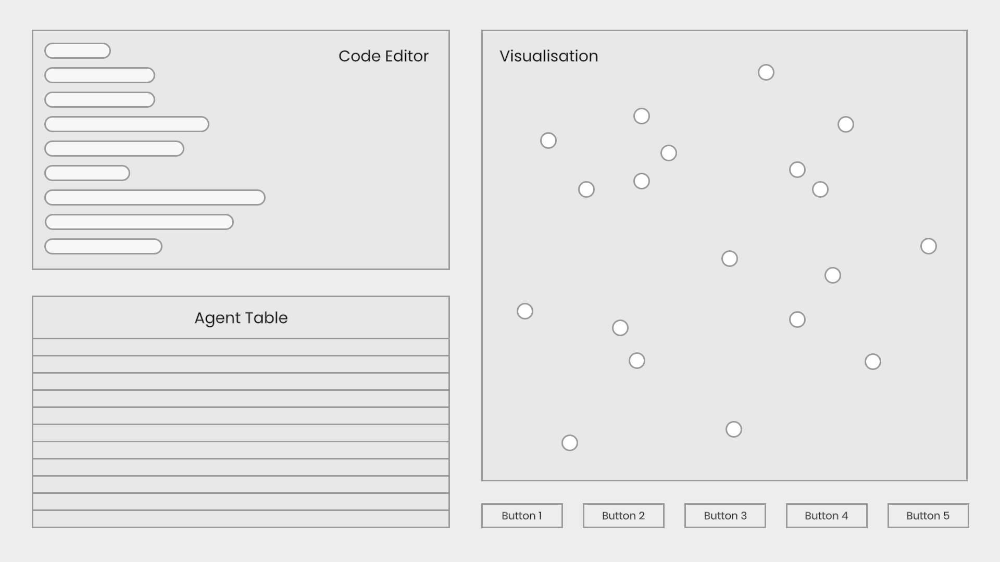

# AgentLang - project specification

This document serves as a detailed project specification for the agent-based modeling language **AgentLang**.

<table>
    <tr><td><b>Author</b></td><td>Tomáš Boďa</td></tr>
    <tr><td><b>Version</b></td><td>1.0.0</td></tr>
    <tr><td><b>Date</b></td><td>30 April, 2023</td></tr>
</table>

## About
**AgentLang** is a programming language designed exclusively for modeling agent-based simulations. Its syntax and structure allows for simple understanding and usage, but more importantly for easy conversion to table-based, almost no-code interface for modeling agent-based simulations.

## Table of contents
1. [Basic information](#basic-information)
   1. [About agent-based modeling](#about-agent-based-modeling)
   2. [Project description](#project-description)
   3. [Technologies](#technologies)
2. [Software specification](#software-specification)
   1. [Aim of the project](#aim-of-the-project)
   2. [Main functionality](#main-functionality)
      1. [Interpreter](#interpreter)
      2. [Web interface](#web-interface)
         1. [Source code editor](#source-code-editor)
         2. [Table-based editor](#table-based-editor)
         3. [Visualisation](#visualisation)
   3. [Wireframe](#wireframe)
3. [Language design](#language-design)
   1. [Agents](#agents)
   2. [Data types](#data-types)
   3. [Variables](#variables)
   4. [Conditional statements](#conditional-statements)
   5. [Built-in functions](#built-in-functions)
      1. [Agent-related functions](#agent-related-functions)
      2. [Mathematical functions](#mathematical-functions)

## Basic information

### About agent-based modeling
Agent-based model is a computational model and a simulation technique that uses autonomous entities (agents) in order to understand the behaviour and outcome of a system over time. It is used in variety of scientific fields, most common of which are social science, epidemiology, biology or economy. Agent-based models are most commonly implemented as computer simulations, therefore, a programming language for defining agents and their behaviour is necessary to be able to simulate an agent-based model.

### Project description
The main purpose of this project is to develop an interpreted programming language designed exclusively for agent-based simulations. Moreover, the language should be accessible to people of all scientific fields, especially those with little or no programming experience. Therefore, the language is designed in a way it can be easily converted to and represented by a table of agents and their attributes, making it easy to understand and implement.

The project consists of the following modules.
- **interpreter** - a program that parses and runs the **AgentLang** source code
- **web application** - a web-based interface for editing source code and visualising the simulation

### Technologies
Since agent-based simulations do not require fast and efficient processing and runtime, the **AgentLang** interpreter as well as the web-based interface will be developed in **TypeScript** using the **Node.js** runtime environment. For the web-based application, I opted for the **React.js** framework to handle the user interface.

## Software specification

### Aim of the project
Since agent-based modeling is useful in many scientific fields, it is necessary to allow people with little to none programming background to be able to model agent-based simulations. Therefore, the main reason behind the idea of this project is the market absence of a simple agent-based modeling language available for everyone including people with non-technical background. Because of that, apart from the programming language itself, the user will be able to use the table-based modeling interface which requires only rudimentary programming knowledge. The source code and the table-based editor will be mutually convertible, meaning that the user will be able to use both simultaneously.

### Main functionality

#### Interpreter
The interpreter will be a standalone program responsible for running the **AgentLang** source code. Its input will be a single string containing the source code, and it will repeatedly output an array of agents and their properties each step of the simulation, with a short delay between each step (in milliseconds). The user will be able to specify the delay time to suit their specific use case.

#### Web interface
The web interface will consist of the following parts.
- source code editor
- table-based editor
- visualisation
- control panel

##### Source code editor
The source code editor will be an editable component featuring line numbers and syntax highlighting. It is used for editing the source code of the agent-based simulation.

##### Table-based editor
The table-based editor is an interactive, no-code editor for modeling agent-based simulations. Since **AgentLang** supports multiple agent types, there will be a table for each agent type.

A table consists of rows and columns.

Columns represent individual attributes of the corresponding agent, together with the formulas for each attribute. An attribute formula can be edited by clicking the column and editing its value. After editing an attribute, the table is recalculated.

Rows represent individual agents and the values of their attributes. These values are calculated based on the column formulas.

##### Visualisation
The visualisation will be a two-dimensional grid displaying agents and their attributes. **AgentLang** is built upon a two-dimensional system, meaning that the agents can move in a two-dimensional grid based on their coordinates. Each step of the simulation, the agents' attributes are recalculated and the visualisation is updated in real-time.

##### Control panel
The control panel serves as a configuration panel, mainly for the visualisation. The user will be able to start, stop and reset the visualisation, set the default `x` and `y` agent coordinate attributes or change the color of the agents based on their attributes.

#### Wireframe
Below is a wireframe to the web-based interface containing the source code editor, agent tables, visualisation and control panel.



## Language design
The following sections describe the **AgentLang** language in detail including its syntax, data types, variables, keywords and built-in functions.

### Agents
Agent-based models are based on autonomous entities - agents. Therefore, the `AGENT` datatype is the primary building block of the simulation. It is similar to a class, representing the individual agent attributes (variables) and their behaviour (methods).

The simulation can consist of one or multiple agents, each is given an identifier (name) using which it can be accessed. The following code snippet demonstrates the creation of an agent named `person` and an agent named `house`.
```
AGENT person { ... }
AGENT house { ... }
```
We define an agent by declaring the `AGENT` datatype followed by its identifier. All its attributes and methods are enclosed in the curly brackets `{ ... }`.

### Data types
**AgentLang** is dynamically typed, meaning it determines the data type of a variable on its own. There are three main data types used in the **AgentLang** language.
- **number** - a decimal number
- **boolean** - a true/false value
- **array** - a collection of agents

#### Variables
An agent can have one or multiple attributes which define its behaviour. There are three main variable types an agent can have.
- `VARIABLE` - an attribute which is changed each step of the simulation. It requires initial value initialization followed by an expression based on which it is recalculated
- `CONST` - an attribute representing a constant value which cannot be changed during the course of the simulation
- `DYNAMIC` - an attribute representing a value which is recalculated each step of the simulation using an expression which can but does not have to be dependent on the `VARIABLE` and `CONST` attributes. It is similar to a function, however, it does not support any parameters

Below is an example of a `tired_person` agent, which spawns at certain `x` and `y` coordinates, moves in a random direction each step of the simulation and determines whether to fall asleep or not at the given step based on some probability.
```
AGENT tired_person {
    VARIABLE x: RANDOM(0, WIDTH) = x + RANDOM(0, 1) - 0.5;
    VARIABLE y: RANDOM(0, HEIGHT) = y + RANDOM(0, 1) - 0.5;
    
    CONST sleep_probability = 0.3;
    
    DYNAMIC is_asleep = RANDOM(0, 1) < sleep_probability;
}
```
First, we set the initial values to `VARIABLE` attributes `x` and `y` to random coordinates. Then, we change these values in each step of the simulation by the formula `x + RANDOM(0, 1) - 0.5` and `y + RANDOM(0, 1) - 0.5` respectively. This ensures movement in random direction. Next, we define a `CONST` attribute representing the probability of the agent falling asleep, which is set to `0.3`. Finally, we check in each step whether the agent is asleep or not by generating a random value in range 0 and 1 and checking if it is less than the probability using the formula `RANDOM(0, 1) < sleep_probability`.
 
#### Conditional statements
**AgentLang** supports basic conditional statements. There are five important keywords which can be used in conditional statements.

- `IF` - the beginning of a conditional statement followed by a condition - a boolean expression based on which further action is taken
- `THEN` - this keyword is followed by an expression executed if the condition is satisfied
- `ELSE` - this keyword is followed by an expression executed if the condition is not satisfied
- `AND` - this keyword is used in boolean expressions and represents conjunction
- `OR` - this keyword is used in boolean expressions and represents disjunction

Suppose we are simulating the progression of an epidemic. We need to know how many days remain until an infected person gets healthy again. We set the infected timespan to a constant number of 14 days and create a `DYNAMIC` attribute indicating whether a person is infected or not (not implemented here). To determine the remaining infected days, we can create a conditional statement. If the person is already infected, decrement its value, since a day passed (day = simulation step) Otherwise, set its value to the infected timespan, since the patient is healthy.
```
AGENT person {
    CONST infected_timespan = 14;
    DYNAMIC infected = ...;

    DYNAMIC days_remaining = IF infected THEN days_remaining - 1 ELSE infected_timespan;
}
```
Now, let's determine whether a person is infected or not. If they are infected and the 14 days haven't passed yet, they should stay infected. Otherwise, check if there are any infected people in proximity and if yes, become infected with a certain probability. We can simulate this using the below code.
```
AGENT person {
    CONST infected_probability = 0.1;

    DYNAMIC days_remaining = ...;
    DYNAMIC infected_neighbours = ...;

    DYNAMIC infected = (infected AND days_remaining > 0) OR (COUNT(infected_neighbours) > 0 AND RANDOM(0, 1) < infected_probability);
}
```

#### Built-in Functions
There are several built-in functions that are used primarily for agent aggregations and mathematical calculations.

##### Agent-related functions
- `GENERATE` - this method is necessary in starting the simulation is used to generate a fixed number of agents. The first parameter is the agent identifier and the second parameter is the number of agents to be generated
```
AGENT person { ... }

GENERATE(person, 100);
```
- `AGENTS` - this method returns an array of all agents of some type, based on their identifier
```
AGENT animal { ... }
AGENT person {
    DYNAMIC animals = AGENTS(animal);
}
```
- `FILTER` - this method is used to filter an array of agents based on some condition
```
AGENT person {
    VARIABLE x: RANDOM(0, WIDTH) = x + RANDOM(0, 1) - 0.5;
    VARIABLE y: RANDOM(0, HEIGHT) = y + RANDOM(0, 1) - 0.5; 

    CONST distance = 5;

    DYNAMIC people_in_proximity = FILTER(AGENTS(person) as p, SQRT(x * p.x + y * p.y) < distance));
}
```
- `COUNT` - this method returns the number of agents in an array
```
AGENT animal { ... }
AGENT person {
    DYNAMIC number_of_animals = COUNT(AGENTS(animal));
}
```

##### Mathematical functions
- `RANDOM` - returns a random decimal number in a specified range
- `SQRT` - returns the square root of a number
- `ABS` - returns the absolute value of a number
- `FLOOR` - returns the floor value of a number
- `CEIL` - returns the ceiling value of a number
- `ROUND` - returns the rounded value of a number
- `SIN` - return the sine of a number
- `COS` - returns the cosine of a number
- `TAN` - returns the tangent of a number
- `COT` - returns the cotangent of a number
- `SINH` - returns the hyperbolic sine of a number
- `COSH` - returns the hyperbolic cosine of a number
- `TANH` - returns the hyperbolic tangent of a number
- `COTH` - returns the hyperbolic cotangent of a number
- `LOG` - returns the logarithm to base 10 of a number
- `LN` - returns the natural logarithm of a number

## Functionality
The following sections describe detailed functionality of the agent-based modeling language interpreter.

## Other requirements

## Additional notes