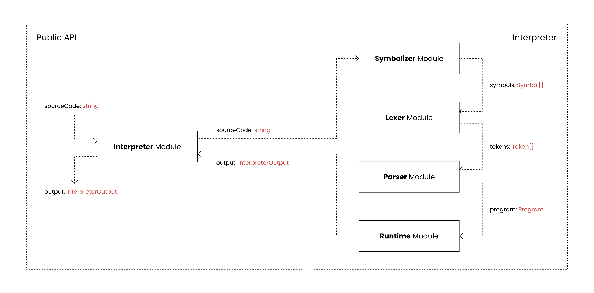
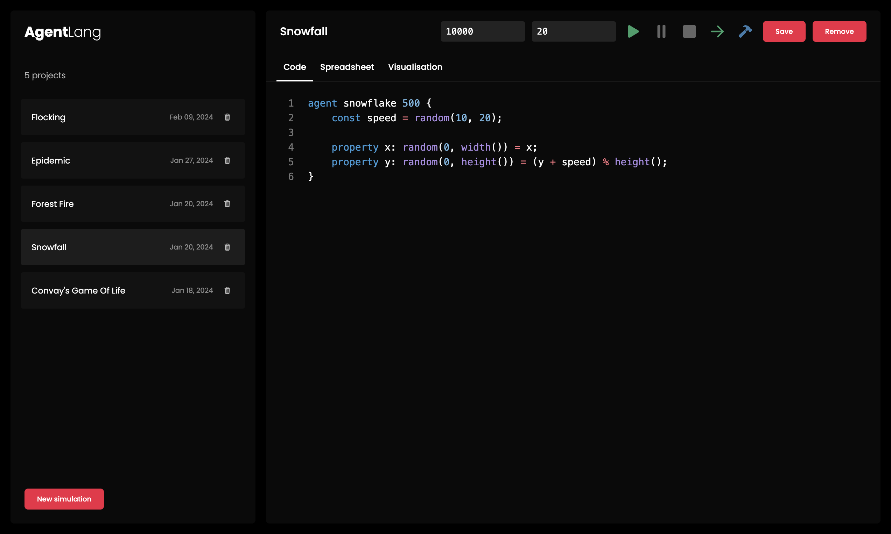
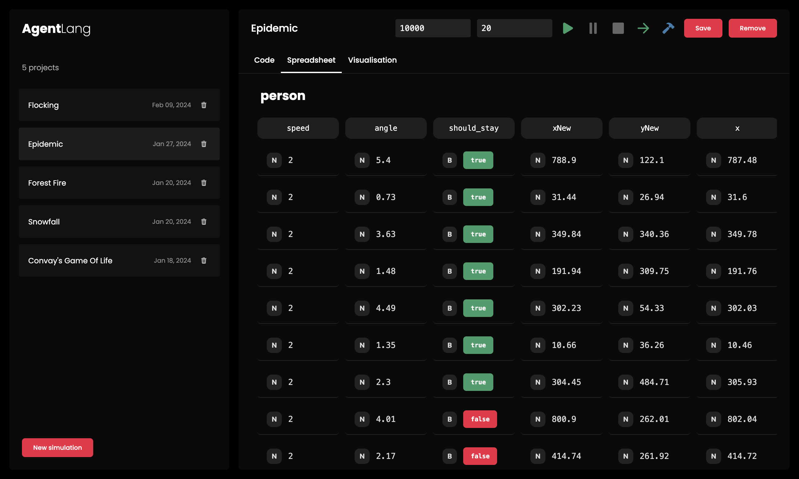
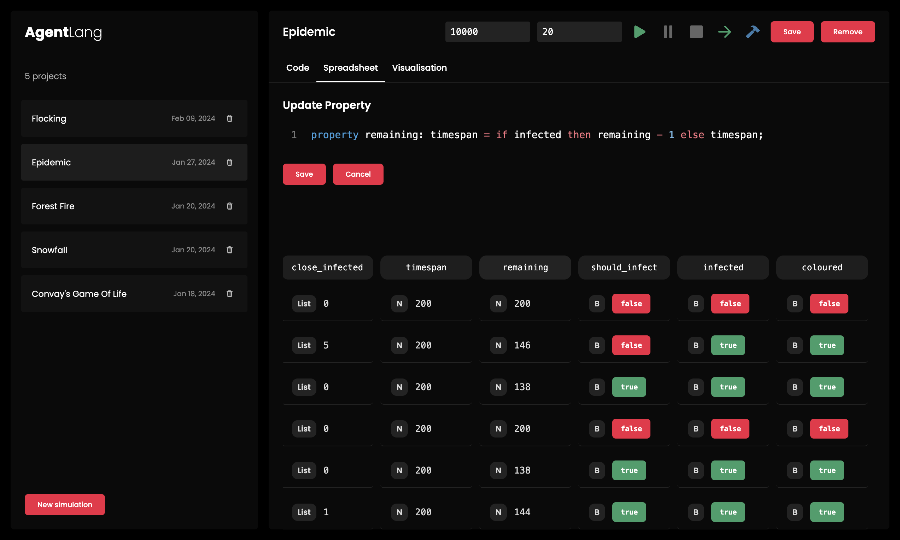
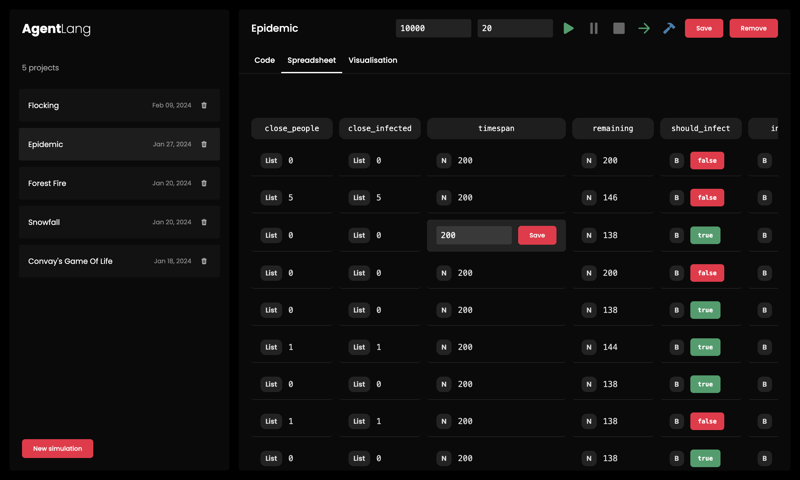
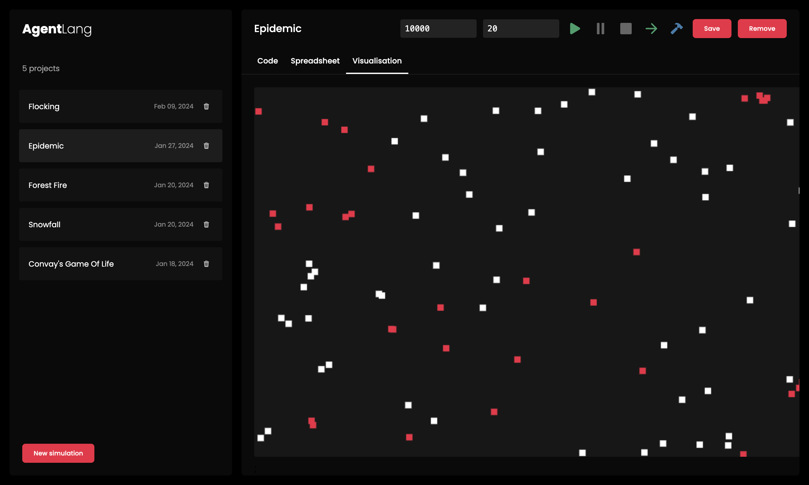

# AgentLang - Programming Language for Agent-based Modeling
Faculty of Mathematics and Physics \
Charles University in Prague, Czech Republic

**Title**: AgentLang - Programming Language for Agent-based Modeling \
**Author**: Tomáš Boďa \
**Department**: Department of Distributed and Dependable Systems \
**Supervisor**: Tomáš Petříček

## Abstract
In this thesis, we develop a new programming language (AgentLang) designed exclusively for modeling agent-based simulations. Agent-based modeling refers to a simulation technique that analyses the dynamics of a simulation using the decisions of autonomous entities called agents and is becoming more and more popular, since these models are easier to understand than more complex mathematical models. The language provides constructs for defining agents and their decision-making logic, while maintaining high level of syntax and semantic simplicity, making it simple to learn and use. The simulation operates in an incremental manner, allowing for evalutation and debugging of each step separately. Apart from the language itself, the project provides a web-based sandbox with a spreadsheet interface, through which it is possible to adjust agent properties and values during runtime of the simulation. Although there are numerous agent-based tools available, this language together with the spreadsheet interface aims to provide a new approach for modeling agent-based simulations and makes agent-based modeling more accessible to people of all scientific and non-scientific fields.

Keywords: agent-based modeling, simulation, programming language, interpreter

## Introduction
In the realm of many scientific fields, the importance of simulations and predictions of certain events within an isolated environment cannot be overstated. This is on one hand due to the lack of resources and space for such simulations in the scale of real-world scenarios, on the other hand due to ethical and moral reasons, such as in epidemiology or sociology. As our understanding of complex systems deepens, the demand for sophisticated tools to model and analyse the dynamics of simulations increases. This is where agent-based modeling comes into play, offering a new and more straightforward approach for handling complex simulations.

Agent-based models are built on top of agents, which represent the fundamental units of the given system, such as people in an epidemic or birds in a flock. To build such models, there is a need for tools or languages that provide constructs for representing agents, their properties and their decision-making logic. Such tools already exist and are widely used to model agent-based simulations, such as NetLogo, GAMA or AgentScript. These tools are powerful and can handle large volumes of agents. However, with their performance comes the cost of complexity of usage and inaccessiblity to people with little to none technical knowledge. They are many times difficult to learn, since they are based on modern programming languages, restricting the use case to developers only. And since the demand for agent-based models can be seen in non-technical scientific fields such as epidemiology or sociology, there is a need for simpler tools and languages.

AgentLang aims to provide a new approach to modeling agent-based simulations. This is on one hand due to the simplicity of the language itself, since it features very simple syntax and only the necessary constructs for modeling almost any simulation. On the other hand, the language is integrated into a specialised web-based interface, which offers a code editor, a visualisation module and most importantly, a spreadsheet interface with runtime agent editing capabilities, which allows users to fine-tune the simulation in real-time. These above features of the AgentLang framework provide all the necessary tools to model agent-based simulations and get a hands-on experience with the language itself.

The structure of AgentLang is very straightforward. We define the individual agent models and for each model, we define its behaviour using a set of properties.
```
agent snowflake 500 {
    const speed = random(10, 20);

    property x: random(0, width()) = x;
    property y: random(0, height()) = (y + speed) % height();
}
```
The above example generates a set of 500 snowflakes, each with a random falling speed and lets them fall on the ground by incrementing their vertical coordinates by their speed.

In conclusion, the main intention behind the creation of AgentLang is to make agent-based modeling available to all scientific domains, regardless of their technical background, allowing for a very shallow learning curve and usability using the following benefits:
- simplistic language syntax designed for easy conversion to the spreadsheet representation
- spreadsheet interface for almost no-code modeling
- built-in visualisation module for better understanding of the simulation

## 1. Theoretical Background
Before diving into the language specification, it's important to introduce and briefly explain the theoretical background behind the most important concepts used in AgentLang. The following sections aim to provide an introduction to agent-based modeling, its use cases and real-world applications as well as a brief overview of language interpreters and parsers.

### 1.1 Agent-based Modeling
AgentLang is a domain-specific language designed exclusively for modeling agent-based simulations. Therefore it is necessary to understand the motivation behind the agent-based modeling technique and its increasing popularity in the recent years as well as to demonstrate its power and applications on several use cases on real-world examples.

#### 1.2.1 Introduction
Agent-based modeling is a simulation technique used in many scientific fields to model and understand complex simulations. In agent-based modeling, a system is modeled using a set of autonomous entities called agents. An agent represents a fundamental meaningful unit of a system, such as a person in an epidemic or a bird in a flock. Each agent individually asseses the current situation, both of itself as well as of other agents and makes decisions based on a set of defined rules.

It's important to note that agent-based modeling is more of a mindset than a technology. The main idea behind it is to describe a system from the perspective of its constituent units. If we can assess and understand the behaviour of a fundamental unit of the system, we can define the model or structure of this unit, generate a set of these units and let their behaviour and interaction among themselves determine the outcome of the simulation. The advantage of such models is their simplicity in terms of understanding and implementation. However, even a simple agent-based model can portray complex behavioral patterns and provide insights into the dynamics of the system that it emulates.

#### 1.2.2 Benefits of Agent-based Models
Agent-based modeling offers numerous advantages when compared to other mathematical models and simulation techniques.

First and foremost, the approach of agent-based modelling allows us to uncover novel emergent phenomena within the system, phenomena that were previously unknown or considered improbable. When we establish and define the rules governing the behaviour of agents, the anticipated actions of individual agents seem straightforward, given the simplicity and predictability of these rules. However, upon executing an agent-based model involving numerous interacting agents, the system's behavior often proves to be surprisingly complex. Even slight changes to the agents' behaviour may have a profound impact on the overall outcome of the system, a phenomenon that can be seen for instance in sociology, where the collective behavior of a group can be significantly influenced by subtle changes in the behavior of an individual.

Furthermore, agent-based modeling is particularly well-suited for simulation domains involving individual behavioral entity types and their mutual interactions. This is especially true in scenarios requiring the analysis of human interaction, understanding principles behind bird flocking, or predicting traffic jam occurrences on certain city roads. These situations pose challenges for other mathematical models, which may not explicitly consider the fundamental unit of the system as a whole.

Last but not least, agent-based models are flexible and extensible. We can easily introduce new agents to the system or increase the quantity of existing agents. Modifying the model's behavior is as simple as fine-tuning the decision-making logic within the agent's model, which may lead to a whole new beahviour of the whole system. This degree of flexibility and extensibility implies the usage of agent-based models in scenarios where the level of complexity of the simulation is either highly unpredictable or unknown in advance, making it easy to fine-tune the simulation without the need for making too many adjustments.

#### 1.2.3 Use Cases
Agent-based modeling is used in numerous scientific areas and systems. Let's dive deeper into some of the major classifications of its usage, which are:
1. flows
2. markets
3. organizations

##### 1.2.3.1 Flows
To describe the idea behind flows, let's consider the evacuation of people. The behaviour of a crowd in a sudden or unexpected dangerous situation often leads to panic and chaos. These situation usually arise during mass events such as concerts, sporting events and demonstrations, where there is high density of people on a certain area. In case of fire or other disasters of such nature, people in panic are obsessed by short-term personal interests uncontrolled by social and cultural constraints.

To prevent uncontrolled behaviour and maximize the chances of successful evacuation, we need to design venues and their escape exits in the best way possible. This is a typical scenario suitable for agent-based modeling. In agent terms, collective panic behaviour is an emergent phenomenon that results from relatively complex individual behaviour patterns and interactions between individuals, such as mutual excitation of a primordial instinct, chain reaction or social facilitaion. Based on prior historical observations, statistics and sociological studies, we can fairly accurately define the behaviour of a person in such situations and observe the reaction of masses during evacuation.

##### 1.2.3.2 Markets
Another typical usage of agent-based models is in economics, where the dynamics of the stock market or the housing market results from the behaviour of many interacting agents, leading to the aforementioned emergent phenomena that are best understood by using a bottom-up approach - agent-based modeling.

In a study published in 2018, a consortium of three scientists and academics embarked on an inqiuiry into the housing market, leveraging an agent-based model with the aim to analyse the relation between income segregation, income inequality and house prices. Through the specification of the buyer-seller dynamics and the price formation mechanisms, the study concluded two primary insights:
1. a more unequal income distribution lowers the prices globally, but implies stronger segregation
2. a spike of the demand in one part of the city increases the prices all over the city

The model is a fairly simple grid on a Cartesian plane, where a specific point in the grid represents a specific location and space is defined by different levels of attractiveness, a variable subsuming exogenous intrinsic features and endogenous social characteristics. In this model, prospective buyers, drawn from external locations engage in the metropolitan housing market seeking accomodation, whereas households already living in the city decide to put their housing on sale based on a certain probability. Such households are referred to as the sellers. The buyers with heterogenous incomes bid a certain amount of money proportional to their income in order to secure a property. The sellers, on the other hand determine the price they ask by employing an aspiration level heuristic. At each location in the grid, buyers and sellers are matched through a continuous double auction mechanism. Successful buyers take residence in the location where they searched and succeeded, whereas sellers leave the city. Finally, market prices at each location are derived as the mean value of successful transactions, thereby illuminating price dynamics.

All of the standalone entities, such as locations, buyers and sellers are represented using agents with defined set of rules and interaction logic, providing a model of the simulation capable of capturing emergent phenomena, such as the relation of income inequality and income segregation in the context of the housing market.

##### 1.2.3.3 Organizations
Another promising area of application for agent-based modeling is organisational simulation. Operational risk poses a constant threat to various sectors, such as financial institutions, stemming from potential issues such as inadequate business information systems, breaches in internal control, fraud or unforseen catastrophes, all of which can lead to unexpected financial losses. In banking, operational risk, as defined by the Basle Committee on Banking, encompasses breakdowns in internal controls and corporate governance, potentially resulting in financial losses due to errors, fraud or failure to perform in a timely manner or compromises to the bank's interests caused by staff members exceeding their authority or conducting business in an unethical or risky manner. This risk is increasingly recognized as the most prominent and significant challenge faced by banks.

In contrast to market risks, operational risks predominantly arise internally within organisations, lacking a straightforward mathematical or statistical correlation between individual risk factors and the magnitude and frequency of operational losses. The lack of historical data on operational losses and their causes further complicates risk assessment, as large losses occur infrequently, leaving many banks without a sufficient time series of relevant data. This leads to uncertainty about which factors are important arising from the absence of a direct relationship between the risk factors.

Given all of these characteristics of operational risks within organisations, it is obviously difficult to quantify. Therefore, a bottom-up simulation to assess the probabilities of operational risks looks like a promising approach, since what is needed is a framework that includes the possibility of non-linear effects because of interactions among sub-units and to cascading events. Modeling the bank's agents, such as their workflow and risk factors that could potentially impact their activities and performance is the first step. Then, external factors, such as the bank's customers, markets and regulators are modelled to simulate the bank's environment. Using this approach, we can observe the emergent phenomena in form of cascading failures and analyse the operational risks of an organisation in a more straightforward way, without the knowledge of any direct relationships between failures and the bank's inner workings in advance.

### 1.2 Interpreters
AgentLang is an interpreted language, which poses various advantages as well as disadvantages in terms of implementation and performance. This section aims to provide a brief introduction into the inner workings of interpreters and language parsers and describe the main concepts used in their implementation.

#### 1.2.1 Compilers vs. Interpreters
In order to better understand the main advantages and disadvantages of interpreters, let's introduce and compare the two primary approaches to developing programming languages - compilers and interpreters.

Compilers and interpreters are the fundamental components of programming languages. They are responsible for reading the source code of the target language and executing its instructions. They both work in a slightly different way, each boasting its own set of strengths and weaknesses.

A compiler translates the source code of a program into machine instructions or an intermediate representation of the code before execution. The process of reading, analysing and transforming the source code involves several stages, including lexical analysis, semantical analysis, optimisations and code generation. Once compiled to machine code, the resulting executable can run independently of the original source code. Since compilers transform the source code to direct machine instructions, they tend to offer high performance, however, they are difficult to understand, implement and debug.

In contrast, an interpreter processes the source code line by line, translating and executing each instruction in real-time as the line is being read. Interpreters can also feature lexical and semantical analysis, but they do not produce an intermediate representation of the source code. They generate a semantical representation of the program's source code, also referred to as the abstract syntax tree (AST), which is then evaluated instruction by instruction during runtime. Therefore, interpreters usually tend to be slower than compilers. However, they provide higher flexibility and ease of debugging.

#### 1.2.2 Workflow
Interpreters are usually implemented in a manner similar to the pipeline architectural style. During the process of interpretation, the source code is fed through and transformed by several processors before finally being executed by the interpreter's runtime.

Firstly, the source code is read by the lexer, which produces an array of tokens. A token is a single basic unit of the language, such as an identifier, a keyword or a numeric literal. The lexer has a set of defined, language-specific rules for producing the tokens, such as recognizing and classifying reserved language keywords or special characters. This step is called the lexical analysis.

The array of tokens is then passed to the parser, which based on a set of defined rules of the target language's grammar analyses sub-sequences of tokens, validates their integrity and produces a semantic representation of the program. This representation is also called the abstract syntax tree (AST), since it is a tree-like structure holding the semantics of the program. It can be understood as an intermediate code representation, which is validated and ready to be passed to and evaluated by the runtime module. This step is called the semantical analysis.

Finally, the abstract syntax tree is passed to the interpreter's runtime, which traverses the AST using a depth-first search algorithm and evaluates the program instruction by instruction. Therefore, the instructions of the target language are evaluated and executed by the programming language in which the interpreter is implemented in.

#### 1.2.3 Parsers
Although each part of the process of transforming the source code and generating the program's output is interesting and worth explaining to greater detail, the parser is without doubt one of the most interesting part of an interpreter. The main responsibility of a parser is to evaluate the stream of tokens coming from the lexer, validate these tokens against the production rules of the target language's grammar and produce the semantic representation of the program - the abstract syntax tree.

Parser is usually implemented as a pushdown automaton (PDA). This is because the syntax of a language can be defined by a set of production rules called the syntax grammar. This automaton accepts the given grammar, therefore is able to validate the correctness of the input source code. The automaton is fed a stream of tokens from the lexer. The evaluation starts at the intitial state and based on the next token, it decides which state it goes to next. In case it comes across a token which cannot be pushed to a new state, since such state does not exist, it is redirected to the fallback state. This scenario is called a semantical error and in such case, the interpreter throws an exception. This aforementioned approach, however, is specific to top-down parsing only. There are various parsing techniques, each suitable for different use cases.

##### 1.2.3.1 Top-down vs. Bottom-up Parsing
There are two primary techniques in parsing language grammars: top-down parsing and bottom-up parsing.

In top-down parsing, the parsing starts from the root of the parse tree, which is the start symbol of the language grammar and proceeds towards the leaf nodes of the parse tree, attempting to match the current input token against the production rules of the grammar. This technique is relatively easy to implement, since it corresponds well to the way humans tend to think about parsing.

In contrast, bottom-up parsing starts from the input string and proceeds by identifying sequences of terminals and non-terminals in the input string that match the right-hand side of some production rule in the grammar. These sequences are then replaced by the corresponding non-terminal symbol. The parser iteratively attemps to match the terminals and newly created non-terminals agains the production rules of the grammar, eventually resulting in the entire input string being replaced by the start symbol of the grammar. The advantage of bottom-up parsing is that it can handle a wider class of language grammars than top-down parsing, including left-recursive grammars and is in many cases more efficient than top-down parsing. However, it is much more difficult to implement and understand conceptually.

##### 1.2.3.2 Recursive Descent Parsing
One of the more popular top-down parsing techniques is recursive descent parsing, also used and implemented in the AgentLang's interpreter. In recursive descent parsing, each non-terminal in the grammar corresponds to a function in the parser module. These functions call each other to parse different parts of the input source code. When parsing a program from the beginning, the parser calls the `parseProgram` function, which further calls `parseVariableDeclaration` and `parseObjectDeclaration` functions, based on the type of the token in the stream. This goes all the way to the `parsePrimaryExpression` function, which parses low-level expressions, such as numeric or string literals.

The idea behind the implementation of such pushdown automaton is that the stack of the automaton is implemented using the call-stack of the language in which the interpreter is implemented. When the function calls nest into each other, they are stored onto the call-stack, preserving their state. We are pushing non-terminals onto the stack, processing them, producing parts of the AST and in case of correct input eventually ending up back in the initial state with an empty stack, having the AST of the program produced and validated.

The technique of recursive descent parsing is used in the implementation of the AgentLang's parser. This is due to the simplicity of the language's syntax grammar and is a good starting point for implementing a simple parser such as that of AgentLang.

## 2. Analysis
The previous section covered the most important theoretical concepts and terms that will be used throughout the thesis and that are the main building blocks of the AgentLang framework. This section explores the motivation behind the creation of AgentLang, analysis and comparison with existing agent-based tools and finally outlines the main goals that this thesis strives to achieve.

### 2.1 Motivation
Developing a programming language that addresses challenges and introduces innovation is increasingly difficult nowadays, given the wast number of languages offering all kinds of features. These languages can be classified into several categories, spanning from general-purpose programming languages to domain-specific languages as well as modelling languages. General-purpose languages, renowned for their versatility and widespread adoption among developers worldwide offer a broad set of language constructs and concepts. Therefore, developing a general-purpose programming language introducing innovations is rather challenging. Moreover, such languages are difficult to implement and require a lot of time and effort for their development. On the other hand, domain-specific languages serve as more of niche tools for tackling issues with domain-specific challenges. As technology is on the rise these days, new domains emerge that need specific tools to handle the tasks they pose. One of such domains is agent-based modeling.

Agent-based modeling, although being a simulation technique with a long history, continues to reveal variety of new applications and use cases across numerous scientific fields and domains. There are many agent-based specific tools that allow for modeling agent-based simulations, each boasting its set of strengths and weaknesses. Despite their power and extensive feature set, these tools often feature complex syntax and language constructs, limiting their usage to technical scientific domains only. Moreover, many of these tools are tailored to specific domains only, such as NetLogo for social and natural sciences. In response to these reasons, the idea of AgentLang emerged, aiming to offer a unified language and environment for agent-based simulations of any nature, accessible to all scientific fields, regardless of their technical proficiency.

### 2.2 Existing Agent-based Tools
Before outlining the primary goals of this thesis, it is important to mention some of the existing agent-based tools to highlight the main differences between existing agent-based frameworks and AgentLang.

#### 2.2.1 NetLogo
Perhaps one of the most wide-spread agent-based modeling software is NetLogo. It is a multi-agent programmable modeling environment with its own domain-specific language as well as a web-based modeling interface. NetLogo's primary simulation domains are social and natural sciences, for which ti provides a rich library of simulation models and examples. It was first introduced and released in 1999 by Uri Wilensky, a professor at the Northwestern University in Illinois, US. Nowadays, it is used by hundreds of thousands of students, teachers and researches all among the world.

Below is an example NetLogo simulation source code.
```
turtles-own [
  flockmates
  nearest-neighbor
]

to go
  ask turtles [ flock ]
  repeat 5 [ ask turtles [ fd 0.2 ] display ]
  tick
end

to flock
  find-flockmates
  if any? flockmates
    [ find-nearest-neighbor
      ifelse distance nearest-neighbor < minimum-separation
        [ separate ]
        [ align
          cohere ] ]
end
```
NetLogo is a powerful tool capable of handling thousands of agents and their complex behavioural patterns seamlessly. However, with its performance comes the cost of language complexity and a steep learning curve. The language has a specific syntax, which may be unfamiliar for developers and data analysts, not to mention scientists of non-technical scientific fields.

#### 2.2.2 GAMA
Another popular modeling and simulation framework is GAMA. It is designed to handle spatially explicit agent-based simulations, such as urban mobility, climate change adaptation, epidemiology, disaster evacuation strategies or urban planning. Its advantages include the generality of the framework and opennes to user-defined plugins as well as the possibility to use GAMA externally in custom software or in different programming languages. One of the most important strengths of GAMA is the availability to non-technical scientists. It is quite easy and straightforward to create and run the first simulation in the matter of minutes. However, GAMA is a large and rich environment with a steep learning curve if the aim is to use it regularly and in non-trivial ways. Moreover, as well as in NetLogo, its language is specific in design and structure, making it difficult to learn, even for people of technical scientific domains.

Below is an example GAMA simulation source code.
```
species people skills: [moving] {  

    reflex time_to_work when: current_date.hour = start_work and objective = "resting" {
        objective <- "working" ;
	      the_target <- any_location_in (working_place);
    }
		
    reflex time_to_go_home when: current_date.hour = end_work and objective = "working" {
        objective <- "resting" ;
	      the_target <- any_location_in (living_place); 
    } 
}
```

#### 2.2.3 AgentScript
Finally, a more familiar agent-based framework utilising an existing programming language is called AgentScript. AgentScript is more of a library than a framework. It provides a set of JavaScript classes and methods used to create and run agent-based models in the browser. AgentScript is heavily inspired by NetLogo, thus its main building blocks consist of three actors: turtles, patches and links. The user defines the behaviour and interaction logic of these three actors and the library takes care of the rest, such as real-time simulation visualisation or agent manipulation. Although the whole concept of AgentScript is familiar, easily understandable and usable by JavaScript developers, it poses challenges for people with limited programming and JavaScript skills. JavaScript, as many other programming languages has its structure and rules, which the user needs to know apart from the AgentScript semantics itself.

Below is an example AgentScript simulation source code.
```
export default class FireModel extends Model {
    density = 60;

    constructor(worldDptions = World.defaultOptions(125)) {
        super(worldDptions);
    }

    step() {
        this.fires.ask(p => {
            p.neighbors4.ask(n => { if (this.isTree(n)) this.ignite(n); });
            p.setBreed(this.embers);
        });
        this.fadeEmbers();
    }

    ignite(p) {
        p.type = this.fireType;
        p.setBreed(this.fires);
        this.burnedTrees++;
    }

    fadeEmbers() {
        this.embers.ask(p => {
            const type = p.type;
            const ix = this.patchTypes.indexOf(type);
            if (type === 'ember0') p.setBreed(this.patches);
            else p.type = this.patchTypes[ix + 1];
        });
    }
}
```

### 2.3 Goals
By analysing the above existing agent-based tools, we come to the following conclusions. Firstly, each of these tools is either directly based on an existing general-purpose programming language, such as AgentScript or provides its own domain-specific language, which is very distinct in terms of syntax and structure, such as NetLogo or GAMA. The former requires the understanding of the underlaying programming language, whereas the latter requires to learn a brand new language. Moreover, these tools are often very complex and offer a wide range of features, which at one hand is useful for agent-based specialised scientists, but on the other hand discourages the rest by their steep learning curves. In response to these characteristics, AgentLang aims to fulfil the following goals:
1. provide a unified, balanced language with simple and straightforward syntax and structure
2. offer only the necessary, essential core library of features
3. allow for an alternative way of simulation modeling using a familiar approach in form of spreadsheet representation

## 3. Language Specification
The following sections focus on the detailed language specification of AgentLang, describing its structure, syntax, data types as well as its standard library and core functionality.

### 3.1 Introduction
AgentLang is a programming language designed exclusively for modeling agent-based simulations. It is an interpreted programming language and its interpreter is written in TypeScript. Its syntax is very simple and straightforward, yet it may resemble modern general-purpose programming languages such as Python or JavaScript, establishing a nice balance between the ease of use for non-technical scientists as well as familiarity for developers.

The structure of AgentLang is very natural and straightforward in terms of the way humans tend to think about agent-based models. The user defines one or multiple agents and for each agent a set of their properties. An agent can be viewed as a class in an object-oriented programming language and a property can be understood as a member variable of this class. Apart from the declarations of agents and their properties, AgentLang supports the declarations of global variables, which are constant values that can be reused among all agents. User-defined functions with parameters are however not supported.

Each agent property has a strictly inline value defined by an expression. The language does not allow for code blocks with multi-statement definitions, except for the agent body.

Since AgentLang is an interpreted language, the program is evaluated in an incremental manner, agent by agent, property by property. Although this would imply that a property cannot be accessed unless defined earlier, it is not so, since the interpreter has a built-in topological property sorting mechanism, which determines the order in which properties are evaluated during runtime. However, more about this concept will be discussed in later sections. The output of the interpreter is an array of agents and the current values of their properties. This gives the developer the flexibility to analyse and use the output in any way they need.

Apart from the source code, the AgentLang interpreter takes four additional configuration parameters, which are `steps`, `delay`, `width` and `height`. The `steps` parameter sets the number of steps the simulation should run. A step refers to a single evaluation of the program. The `delay` parameter determines how often the interpreter should emit the output, more specifically, how long it should wait (in milliseconds) before evaluating the next step of the simulation. The `width` and `height` parameters are important for the interpreter to initialize the built-in `width()` and `height()` functions used in the simulation's visualisation. For instance, a configuration with `steps = 100` and `delay = 10` means that the simulation will emit 100 uniformly distributed program evaluations in the matter of 1000 milliseconds.

### 3.2 Syntax Grammar
To give a brief overview of the AgentLang's syntax, below are the production rules of the AgentLang's syntax grammar. Terminal symbols are encapsulated in double quotes and non-terminal symbols are represented by pure identifiers written in snake case.
```
program:
    | declaration
    | declaration program

declaration:
    | define_declaration
    | agent_declaration

define_declaration:
    | "define" identifier "=" define_value ";"

define_value:
    | numeric_literal
    | boolean_literal

agent_declaration:
    | "agent" identifier agent_count "{" "}"
    | "agent" identifier agent_count "{" agent_body "}"

agent_count:
    | numeric_literal
    | identifier

agent_body:
    | property_declaration
    | property_declaration agent_body

property_declaration:
    | "property" identifier "=" expression ";"
    | "property" identifier ":" expression "=" expression ";"
    | "const" identifier "=" expression ";"

expression:
    | "(" expression ")"
    | identifier
    | numeric_literal
    | boolean_literal
    | function_call
    | conditional_expression
    | relational_expression
    | binary_expression
    | unary_expression
    | logical_expression
    | lambda_expression
    | otherwise_expression

identifier:
    | "[a-zA-Z\_]+"

numeric_literal:
    | "([0-9]+)|([0-9]+.[0-9]+)"

boolean_literal: "true" | "false"

function_call:
    | identifier "(" ")"
    | identifier "(" argument_list ")"

argument_list:
    | argument
    | argument "," argument_list

argument:
    | expression

conditional_expression:
    | "if" expression "then" expression "else" expression

relational_expression:
    | expression relational_operator expression

relational_operator: "==" | ">=" | "<=" | ">" | "<"

binary_expression:
    | expression binary_operator expression

binary_operator: "+" | "-" | "*" | "/" | "%"

unary_expression:
    | unary_operator identifier
    | numeric_unary_operator numeric_literal
    | boolean_unary_operator boolean_literal

unary_operator:
    | boolean_unary_operator
    | numeric_unary_operator

boolean_unary_operator: "!"

numeric_unary_operator: "-"

logical_expression:
    | expression logical_operator expression

logical_operator: "and" | "or"

lambda_expression:
    | expression "=>" identifier "=>" expression

otherwise_expression:
    | expression "otherwise" expression
```

### 3.3 Declarations
Declarations are the top-level constructs of the AgentLang language. They are used to declare agents, properties and global variables.

#### 3.3.1 Agents
Agent is the main building block of a simulation. It represents an agent model and its properties and is used for generating a set of agents for the simulation. Agents are always declared in the top-level program scope and they cannot be nested. Defining multiple agent models is also supported.

To declare an `agent`, we use the following production rule:
```
agent_declaration:
    | "agent" identifier agent_count "{" "}"
    | "agent" identifier agent_count "{" agent_body "}"
```
Below is an example of an `agent` declaration.
```
agent car 20 {
    ...
}
```
AgentLang also supports multiple agent model declarations. To define multiple agent models, declare them one after another in the program scope.
```
agent car 20 {
    ...
}

agent pedestrian 60 {
    ...
}
```
Note that the `agent_count` parameter does not have to be a numeric literal explicitely. We can define a global variable with a numeric value and use this variable's identifier as the `agent_count` parameter.
```
define car_count = 20;

agent car car_count {
...
}
```
More about global variables will be explained later in this section.

After defining agent models, AgentLang will generate the corresponding number of agents for each agent model and evaluate their properties during runtime.

#### 3.3.2 Properties
Properties are essential in defining the behaviour of an agent model. They can be understood as variables with a value defined based on some inline expression. Agents can have any number of properties, either independent or dependent on each other.

AgentLang supports two types of properties, which are `property` and `const`. The `property` property is recalculated in each step of the simulation based on the most current values, whereas `const` is calculated only at the beginning of the simulation, holding a constant value throughout the entire course of the simulation.

##### 3.3.2.1 Const
Property of type `const` is a special kind of property, which holds a constant value during the entire runtime of the simulation. It is calculated only once as the agent is generated.

To declare a `const` property, use the following grammar production rule:
```
property_declaration:
    "const" identifier "=" expression ";"
```
Below is an example of a `const` declaration holding a numeric value.
```
const max_speed = 260;
```
Properties of type `const` are used in cases when we need to for instance generate random initial coordinates of agents, since they are calculated only once at the beginning of the simulation.
```
const x_spawn = random(100, 200);
const y_spawn = random(100, 200);

property x: x_spawn = x + 1;
property y: y_spawn = y + 1;
```

##### 3.3.2.2 Property
Property of type `property` is the most commonly used type of property in AgentLang. It is recalculated in each step of the simulation for every agent, based on the most current values.

To declare a `property` property, use the following grammar production rule:
```
property_declaration:
    "property" identifier "=" expression ";"
```
Below is an example of a `property` declaration that holds a random numeric value between 5 and 10 in each step of the simulation.
```
property current_speed = random(5, 10);
```
However, what if we want to set the property to some initial value and use this property's value in its own declaration?
```
property x = x + 1;
```
In the above example, it is not possible. The `x` property is incremented by 1 in each step of the simulation, however, it is not set to any default value to start with. That is why AgentLang supports default property values.

To declare a `property` with a default value, we use the following production rule.
```
property_declaration:
    "property" identifier ":" expression "=" expression ";"
```
The expression after the semicolon is used to initialise the `property` to some default value in the first step of the simulation. In each next step, the second expression is used to recalculate its value.
```
property x: 15 = x + 1;
property y: 5 = y * 2;
```
A better example would be the earlier example with the current speed. We want the agent to accelarate, so we increment its speed by one.
```
const initial_speed = 0;
property speed: initial_speed = speed + 1;
```
In this way, the speed is set to 0 in the first step and is incremented by 1 in each following step, producing values 1, 2, 3, 4 and so on.

However, this is not the only use case of default property values. Suppose the following exaggerated example, where we have two properties, where each depends on the other.
```
property a = b + 1;
property b = a + 2;
```
This example would throw an error, since there is a cycle in the property declarations. In order to fix this, we need to assign a default value to one of the properties, so that the interpreter knows which property will be evaluated first, so that the other property can calculate its value based on the first property.
```
property a = b + 1;
property b: 0 = a + 2;
```
The above example would work, since at least one of the properties is initialised with a default value. This topic, however, concerns the topological sorting mechanism implemented in the AgentLang's interpreter, which will be explained later in this paper.

#### 3.3.3 Global Variables
Apart from agent and property declarations, AgentLang supports the declaration of global variables which can be reused among all agent models as constant values. Global variables are always declared in the top-level program scope and the best practice is to declare them before all agent declarations.

To declare a global variable, we use the following production rule.
```
define_declaration:
    "define" identifier "=" expression ";"
```
Below is an example of usage of global variable declarations.
```
define person_count = 120;
define default_speed = 5;

agent person person_count {
    const speed = default_speed / 2;
}

agent car 10 {
    const speed = default_speed * 3;
}
```
Note that global variables cannot contain any identifiers or function calls in their definitions. They are plain constant values which can only hold numeric or boolean literals.

### 3.4 Data Types
There are five data types that AgentLang supports, which are numeric literals, boolean literals, AgentList instances, AgentObject instances and Null values.

#### 3.4.1 Numeric Literal
Numeric literal is one of the two primitive data types in AgentLang. A numeric literal represents either an integer or a decimal number. Decimal numbers can have any number of decimal places, however, they are always rounded to up to eight decimal places in the simulation's output.

Numeric literals can be used in many ways, either as raw numeric values or in any numeric expression, such as binary or unary expressions or as parameters to function calls.
```
const integer_value = 3;
const decimal_value = 12.8;
const binary_expression = 6.5 * 2 / integer_value;
const random_value = random(10, 20);
```

#### 3.4.2 Boolean Literal
Boolean literal is the second of the two primitive data types in AgentLang. It represents a binary value, which can either be `true` or `false`.

Boolean literals can be expressed either explicitely, using the `true` or `false` keywords, or they can be the result of some expression, such as the relational expression (more on relational expression later).
```
const is_active = false;
const is_first = index() == 0;

property temperature: 10 = temperature + random(-3, 3);
const is_cold = temperature <= 9;
```

#### 3.4.3 AgentList
AgentList is a special data type representing an array of agent instances. This array cannot be defined explicitely and cannot be indexed and it only results from various built-in function calls.

The easiest way to retrieve an array of agent instances is to use the `agents` function, which returns the current array of agent instances of the specified type.
```
agent prey 10 {
    ...
}

agent predator 5 {
    property preys = agents(prey);
}
```
The `preys` property holds an array of agent instances of type `prey` with their most recent values.

There are numerous built-in functions used for retrieving or manipulating values of type AgentList, which will be described later in this section.

#### 3.4.4 AgentObject
AgentObject is a special data type representing one specific agent instance and its properties. It can be used to retrieve the property values of an agent and use them in later calculations.

Similarly to AgentList, AgentObject can only be retrieved by using specific built-in function calls, such as `min()`.
```
agent person 10 {
    property x = ...;
    property y = ...;

    property closest_person = min(agents(person) => p => dist(p.x, p.y, x, y));
}
```
The above example uses the `min` function together with a lambda expression to retrieve an agent instace of type `person` which is closest to the current person. We can now use the `closest_person` property to retrieve the agent's property values.
```
agent person 10 {
    const is_married = prob(0.5);
    property closest_person = ...;

    property is_closest_person_married = closest_person.is_married;
}
```

#### 3.4.5 Null
Null is a special data type that represents an undefined or missing value. It is tightly bound to the AgentObject data type. Note the following example.
```
define visual_range = 65;

agent person 10 {
    property x = ...;
    property y = ...;

    property close_people = filter(agents(person) => p => dist(p.x, p.y, x, y) < visual_range);
    property close_person = min(close_people => c => dist(c.x, c.y, x, y));
}
```
The `close_person` property attempts to find an agent that is the closest to the current agent, but is also in the visual range of 65. If there are no agents in this visual range, the `close_person` searches an empty array and cannot retrieve a specific agent instance. Therefore, it is assigned a Null value.

A problem with Null values, however, is that we cannot use it in other properties. More specifically, we cannot retrieve the agent's properties, since it does not hold any agent instance, rather a Null value. That is why AgentLang supports the `otherwise` operator, which tackles issues with Null values. The `otherwise` operator will be discussed later in this section.

### 3.5 Expressions
The following sections introduce and showcase all expression types supported by AgentLang, from the most basic ones such as binary or relational expressions to more complex, language-specific expressions such as `otherwise` or `lambda` expressions.

#### 3.5.1 Binary Expressions
Binary expression is the most basic expression in AgentLang. It consists of two numeric operands and one binary operator. The operator can be of type addition, subtraction, multiplication, division or modulo. These expressions can be arbitrarily nested and parenthesised.
```
const add_expr = 2 + 3;
const sub_expr = 6 - 2;
const mul_expr = 12 * 4;
const div_expr = 8 / 3;
const mod_expr = 16 % 6;

const complex_expr = 2 + 3 * 4 - 8 / 14;
const parenth_expr = (2 + 3) * 4 - (12 + 2);
```

#### 3.5.2 Unary Expressions
Unary expressions consist of one numeric or boolean operand together with a unary operator. There are two unary operators, one for numeric unary expressions and the other for boolean unary expressions.

##### 3.5.2.1 Numeric Unary Expression
Numeric unary expression is used to convert a positive number to a negative number using the minus `-` operator. The operand can either be a plain numeric literal or an identifier holding a numeric value.
```
const value = 12.6;
const neg_basic = -12.6;
const neg_ident = -value;
```

##### 3.5.2.2 Boolean Unary Expression
Boolean unary expression is used to negate a boolean value using the emphasis `!` operator. The operand can either be a plain boolean literal (`true` or `false`) or an identifier holding a boolean value.
```
const value = false;
const neg_basic = !false;
const neg_ident = !value;
```

#### 3.5.3 Logical Expressions
Logical expressions are expressions operating on boolean literals and always return a boolean value as the result. They are special types of binary expressions which use the `and` and `or` operators together with two boolean operands.
```
const bool_value = false;

const log_expr_and = true and bool_value;
const log_expr_or = true or bool_value;
```

#### 3.5.4 Relational Expressions
Relational expressions are special types of binary expressions that operate on either numeric or boolean operands and always return boolean results. They use relational operators, such as `==`, `!=`, `>`, `>=`, `<` and `<=`.

The `==` and `!=` operators can be used with either numbers and booleans, since they check for value equality. The rest of the relational operators operate on numeric values only.
```
const bool_1 = true;
const bool_2 = false;

const bool_expr_1 = bool_1 == bool_2;
const bool_expr_2 = bool_1 != bool_2;

const num_1 = 1.5;
const num_2 = 8.4;

const num_expr_1 = num_1 == num_2;
const num_expr_2 = num_1 != num_2;
const num_expr_3 = num_1 > num_2;
const num_expr_4 = num_1 >= num_2;
const num_expr_5 = num_1 < num_2;
const num_expr_6 = num_1 <= num_2;
```

#### 3.5.5 Conditional Expressions
Conditional expressions are used to control the flow of property evaluation. They decide between two alternatives based on some condition. The condition is always a boolean expression and the results can be of any type, based on the data type of the given property.

We use the following production rule for defining a conditional expression:
```
conditional_expression:
    | "if" expression "then" expression "else" expression
```
The `if` keyword marks the start of a conditional expression. It is followed by a boolean expression denoting the condition upon which the structure decides. Then comes the `then` keyword followed by an expression representing the value to be evaluated if the condition is met (is `true`). Finally comes the `else` keyword followed by an expression representing the value to be evaluated if the condition is not met (is `false`).
```
define max_speed = 10;

agent person 5 {
    property speed: 5 = if abs(speed) >= max_speed then speed else speed + random(-1, 1);
}
```
The above example controls the maximum value of `speed` using the `max_speed` global variable. If it overflows, it keeps the `max_speed` value, otherwise it is randomly incremented or decremented.

#### 3.5.6 Otherwise Expressions
The otherwise expression is a language-specific type of expression used to handle issues with Null values. It is a binary expression that uses the `otherwise` operator between the two operands.

The left-hand side of the `otherwise` expression consists of any expression containing a value of type AgentObject. The right-hand side consists of any expression that does not contain a value of type AgentObject. When the `otherwise` expression is being evaluated, AgentLang checks whether the value of type AgentObject on the left-hand side is Null. If not, it evaluates the left-hand side expression. On the other hand, if the value is Null, it instantly switches to the right-hand side of the expression and evaluates it.

Otherwise expressions serve as guards for Null values, for we can only tell if the value of type AgentObject is Null or not Null during runtime.
```
define visual_range = 60;

agent person 120 {
    property x = x + x_move;
    property y = y + y_move;

    property people = agents(person);

    property in_proximity = filter(people => p => dist(p.x, p.y, x, y) <= distance);
    property closest = min(in_proximity => p => dist(p.x, p.y, x, y));

    property x_move = (closest.x - x) / 10 otherwise 0;
    property y_move = (closest.y - y) / 10 otherwise 0;
}
```
The above example finds all people in some visual proximity to the current person and selects the closest person from the list. It then calculates the direction in which the current person should move in order to approach the closest person. However, we cannot be certain that we will find any people in the given proximity. If that's the case, the `in_promixity` property will be an empty array and the `closest` property will therefore result in a Null value. That is why we need to use the `otherwise` operator to ensure that if no such person is found, we will use values `0` for `x_move` and `y_move` properties.

#### 3.5.7 Lambda Expressions
While being classified as expression, the lambda expression is rather a syntactical structure that an expression. It cannot be used on its own, only as a parameter to lambda-specific built-in functions. They are mainly used for traversing arrays of agent instances and manipulating them in some way. Use cases include filtering of agents, summing certain agent properties or finding a specific agent instance based on some condition.

There are several built-in functions that take lambda expression as their parameter, some of which are `filter()`, `sum()`, `min()` and `max()`.

To define a lambda expression, we use the following production rule:
```
lambda_expression:
    | expression "=>" identifier "=>" expression
```
We start with an expression holding a value of type AgentList, followed by the lambda arrow `=>`. Then, we declare the lambda parameter name, which is any identifier we choose, such as `item` followed again by the lambda arrow `=>`. This parameter is used to access each agent instance in the array, one by one. The final part of the lambda expression is an expression representing a condition based on which to manipulate the agent instances.
```
define visual_range = 60;

agent person 120 {
    property x = x + random(-1, 1);
    property y = y + random(-1, 1);

    property people = agents(person);
    property in_proximity = filter(people => p => dist(p.x, p.y, x, y) <= distance);
}
```
The `filter()` function takes a Lambda expression as a parameter. We use the `p` parameter to access each individual agent instance and their properties. Finally, the right-hand side of the lambda expression is used for filtering the agent array based on the proximity of each agent instance to the current agent. The result of `in_proximity` property is a filtered array of agents of type `person`.

### 3.6 Core Library
The AgentLang's core library consists of several built-in functions necessary for agent manipulation as well as mathematical calculations. Below is the complete list of built-in functions and their usage.

#### 3.6.1 Mathematical Functions
The `sqrt(number): number` function is used to calculate the square root of a numeric value.

The `abs(number): number` function is used to calculate the absolute value of a numeric value.

The `floor(number): number` function is used to return the floor value of a decimal numeric value.

The `ceil(number): number` function is used to return the ceil value of a decimal numeric value.

The `round(number): number` function is used to return a rounded value of a decimal numeric value.

The `sin(number): number` function is used to return the sine value of a numeric value.

The `cos(number): number` function is used to return the cosine value of a numeric value.

The `tan(number): number` function is used to return the tangent value of a numeric value.

The `atan(number): number` function is used to return the arc tangent value of a numeric value.

The `pi(): number` function is used to return the value of Pi (3.14...).

#### 3.6.2 Agent Manipulation Functions
The `filter(lambda): AgentList` function takes a lambda argument with a boolean expression as its value and returns a filtered list of agents based on this value.

The `sum(lambda): number` function takes a lambda argument with a numeric expression as its value and returns a sum of these values (from all agents).

The `min(lambda): AgentObject` function takes a lambda argument with a numeric expression as its value and returns an agent object with the minimum corresponding value.

The `max(lambda): AgentObject` function takes a lambda argument with a numeric expression as its value and returns an agent object with the maximum corresponding value.

#### 3.6.3 Utility Functions
The `agents(identifier): AgentList` function returns the list of all agents of the provided type.

The `count(AgentList): number` function takes an AgentList value as a parameter and returns the number of this AgentList value.

The `empty(): AgentList` function return an empty array of agents and is used primarily in defining default property values in case of topological errors.

The `prob(number): boolean` function takes a decimal numeric value between 0 and 1 representing a probability ratio and returns a boolean value based on this probability. If we use `prob(0.8)`, we have a 80% chance of getting a `true` value and a 20% change of getting a `false` value as a result.

The `dist(number, number, number, number): number` function is used to calculate the distance betweem two points in a two-dimensional space. The parameters represent `x1`, `y1`, `x2` and `y2` values.

#### 3.6.4 Special Functions
The `width(): number` function returns the current width of the visualisation grid, which was provided in the interpreter's configuration.

The `height(): number` function returns the current height of the visualisation grid, which was provided in the interpreter's configuration.

The `index(): number` function returns the numeric index of the current agent, starting from 0.

The `step(): number` function returns the value of the current step, starting from 0.

## 5. Implementation
The following sections describe the most important concepts in the AgentLang interpreter's implementation and point out the most important and interesting parts of its architecture and functioning.

### 5.1 Overview and Architecture
The AgentLang's interpreter is written in TypeScript. The choice of this specific language resulted from various reasons. First and foremost, we needed good compatibility and integrability with the web-based interface, which is the primary environment where AgentLang is intended to be used. Furthemore, there was no primary need for high performance, since AgentLang is intended mainly for simple simulations, as a proof of concept of the language itself. Since modern web applications are written mainly in JavaScript frameworks and we opted for the TypeScript-based Next.js framework for the web-based interface, TypeScript felt like a natural choice and and common ground for this thesis.

The interpreter itself follows an architecture resembling the pipeline architectural style. It consists of five main parts, which are
- **symbolizer** - produces an array of symbols together with their positions in the source code
- **lexer** - produces an array of language-specific tokens together with their positions in the source code
- **parser** - produces an abstract syntax tree holding the semantical structure of the program
- **runtime** - traverses and evaluates the abstract syntax tree instruction by instruction and produces the program's output
- **interpreter** - holds all of the above parts together and provides a public API for starting, pausing, resuming, stopping and reseting the simulation



#### 5.1.1 Symbolizer
Symbolizer is a very simple module responsible for one task only - to convert the source code into individual symbols and produce metadata for each symbol, such as its position in the source code. Although it is usually part of the lexer module itself, we decided to put it to a standalone module for better modularity and code readability.

The primary and only method in the symbolizer module is the `symbolize()` method, which reads the source code character by character and produces an array of symbols.
```ts
public symbolize(): Symbol[] {
  const symbols: Symbol[] = [];
  const position: Position = { line: 1, character: 1 };

  for (const character of this.sourceCode.split("")) {
      symbols.push({ value: character, position: { ...position } });
      position.character++;

      if (character === "\n") {
          position.line++;
          position.character = 1;
      }
  }

  return symbols;
}
```
A symbol is based on a simple interface containing the symbol's value and position.
```ts
export interface Symbol {
  value: string;
  position: Position;
}

export interface Position {
  line: number;
  character: number;
}
```

#### 5.1.2 Lexer
As opposed to the symbolizer module, the lexer module performs a slightly more complicated task. It contains language and syntax-specific logic for correctly recognizing and classifying tokens supported by the language. It groups together symbols sequentially and produces corresponding tokens with correct types. For instance, it distinguishes user-defined identifiers from language-specific, reserved keywords, so that the parser can then handle these tokens accordingly. Apart from the program's keywords, the lexer adds a special token at the end of the token array, called the end-of-file token. This token serves as an indicator to the program's end.

A token is based on a simple interface, holding its type, raw value and position in the source code. The position of a token is defined by the position of its first character.
```ts
export interface Token {
  type: TokenType;
  value: string;
  position: Position;
}
```
There are many token types, some of which are:
```ts
export enum TokenType {
  Identifier = "Identifier",
  Number = "Number",
  Boolean = "Boolean",

  OpenParen = "OpenParen",
  CloseParen = "CloseParen",

  Colon = "Colon",
  Semicolon = "Semicolon",

  // ...
}
```
The `tokenize()` method is the main method of the lexer module. It traverses the input array of symbols and checks their value, based on which it decides which token type to generate. Finally, it returns the array of generated tokens.
```ts
public tokenize(): Token[] {
  while (this.hasNext()) {
    switch (this.getNext().value) {
      case "(":
        this.token(TokenType.OpenParen);
        break;
      case ")":
        this.token(TokenType.CloseParen);
        break;
      // ...
      default: {
        // tokenize identifiers
        // tokenize language-specific keywords
        // tokenize numeric literals
        throw new ErrorLexer(`Unrecognized character found in source: ${this.getNext().value}`, this.getNext().position);

      }
    }
  }

  this.token(TokenType.EOF);
  return this.tokens;
}
```
In case the current symbol is not recognized, it throws an exception and the interpreter stops the process.

#### 5.1.3 Parser
The parser module is without doubt one of the most interesting parts of the interpreter. It represents a pushdown automaton accepting the language's grammar and producing an AST representing the semantical structure of the program. The structure of the parser module looks like the following:
```ts
class Parser {

  private tokens: Token[];

  constructor(tokens: Token[]) {
    this.tokens = tokens;
  }

  public parse(): Program {}

  private parseStatement(): Statement {}

  private parseObjectDeclaration(): ObjectDeclaration {}

  private parseVariableDeclaration(): VariableDeclaration {}

  private parseExpression(): Expression {};

  // rest of the parsing methods
}
```
Each `parse...()` method represents one non-terminal of the language's grammar and parses the corresponding non-terminal based on the grammar rules. When we begin parsing the program, we call the `parse()` method of the parser module.
```ts
public parse(): Program {
  const program: Program = {
    type: NodeType.Program,
    body: [],
    position: { line: 0, character: 0 }
  };

  while (this.notEndOfFile()) {
    program.body.push(this.parseStatement());
  }

  return program;
}
```
The method iteratively parses statements one by one until it reaches the end-of-file (EOF) token. Finally, it returns the root node of the AST called `Program`;

Let us revisit a part of the language's formal grammar for the top-level constructs:
```
program:
    | declaration
    | declaration program

declaration:
    | define_declaration
    | agent_declaration
```
The program is defined recursively and parser any number of declarations, which are statements. A declaration is either of type `define_declaration` representing a global variable declaration or `agent_declaration` representing an agent declaration. Now let's take a look at the `parseStatement()` method called by the `parse()` method.
```ts
private parseStatement(): Statement {
  switch (this.at().type) {
    case TokenType.Define:
      return this.parseDefineDeclaration();
    case TokenType.Agent:
      return this.parseObjectDeclaration();
    default:
      throw new ErrorParser(`Only agent and define declarations are allowed in program scope, '${this.at().type}' provided`, this.position());
  }
}
```
We can see that it abides by the grammar rules of statements (declarations). A global variable declaration always starts with the `define` keyword, whereas an agent declaration always starts with the `agent` keyword. If the current token is of any of these two types, we parse the corresponding declaration by calling the `parseDefineDeclaration()` or `parseObjectDeclaration()` methods respectively. In case of other token types, the parser throws an exception, since other token types do not abide by the grammar rules of the language.

These two above parsing methods are very simple, since the right-hand side of their grammar rules are simple. Let us look at a more explicit example of an agent declaration, defined by the following grammar rule.
```
agent_declaration:
    | "agent" identifier agent_count "{" "}"
    | "agent" identifier agent_count "{" agent_body "}"

agent_count:
    | numeric_literal
    | identifier

agent_body:
    | property_declaration
    | property_declaration agent_body
```
The corresponding parsing function is implemented as following:
```ts
private parseObjectDeclaration(): ObjectDeclaration {
  const { position } = this.assert(TokenType.Agent, "Expected agent keyword in agent declaration", this.position());
  const identifier = this.assert(TokenType.Identifier, "Expected agent identifier after agent keyword in agent declaration", this.position()).value;

  this.assertMulti(TokenType.Number, TokenType.Identifier, "Expected number of agents after agent identifier in agent declaration", this.position(), false);

  const count = this.parseExpression();

  this.assert(TokenType.OpenBrace, "Expected an open brace after number of agents in agent declaration", this.position());

  const body: VariableDeclaration[] = [];

  while (this.isNotOf(TokenType.CloseBrace)) {
    switch (this.at().type) {
      case TokenType.Property:
      case TokenType.Const:
        const declaration = this.parseVariableDeclaration();
        body.push(declaration);
        break;
      default:
        throw new ErrorParser("Only property and const declarations are allowed in agent body in agent declaration", this.position());
    }
  }

  this.assert(TokenType.CloseBrace, "Expected a close brace after agent body in agent declaration", this.position());

  return {
    type: NodeType.ObjectDeclaration,
    identifier, count, body, position
  };
}
```
The parsing of an agent declaration starts by checking if the current token is of type `Agent`. If yes, we save its position denoting the start of the agent declaration for future debugging purposes. The next token in the right-hand side of the grammar rule is an identifier. Therefore, we check if the current token is of type `Identifier` and if yes, we save its value. Following the identifier, we expect the next token to be either of type `Number` or `Identifier` denoting the `agent_count` non-terminal. Then, we expect an open brace. Now comes the interesting part. Based on the `agent_body` non-terminal, an arbitrary number of property declarations follows. Hence, we parse the list of property declarations until we reach the close brace token. Then we know that we reached the end of the agent declaration and can return the AST node representing the agent declaration with all its important metadata.

It is also important to mention, that the order in which these parser methods call themselves is of high importance, especially in parsing expressions. This is due to the mathematical concept of operator precedence.Let's illustrate this on an example of two parsing methods responsible for parsing additive and multiplicative binary expressions.
```ts
private parseAdditiveExpression(): Expression {
  let left = this.parseMultiplicativeExpression();

  while (this.at().value === "+" || this.at().value === "-") {
    const token = this.next();
    const operator = token.value;
    const position = token.position;

    const right = this.parseMultiplicativeExpression();

    left = {
      type: NodeType.BinaryExpression,
      left,
      right,
      operator,
      position
    } as BinaryExpression;
  }

  return left;
}
```
A binary expression consists of three main parts - the left operand, the right operand and a binary operator. Since this parser has no token lookahead, we can only consider the current token. Since evaluation of the AST is done using a depth-first search algorithm, we know that the lower in the AST a node is, the sooner it will be evaluated. Based on the operator precedence, more specifically the superiority of multiplication over addition, in case our expression consists of both additive and multiplicative operators, we must parse the multiplicative binary expressions first. Due to this reason, we first evaluate the left-hand side of the potential additive binary expression as a multiplicative expression, so that it lies lower in the AST than the potential additive expression we are trying to parse. Then two possible scenarios can happen - either we find an additive operator (`+` or `-`) after the multiplicative expression or not. In the former case, we parse the right-hand side of the additive binary expression as a multiplicative expression for the same reasons that we parse the left-hand side of the additive expression as a multiplicative expression. In the latter case, however, we return the left-hand side representing a multiplicative binary expression.

To better illustrate the concept behind this way of parsing, let us look at the following two examples:
```
const a = 5 * 2;
const b = 5 * 2 + 3;
```
In the case of `a` we parse the left-hand side as a multiplicative binary expression, only to find out that it is not followed by an additive operator. In that case, we return the multiplicative binary expression from the `parseAdditiveExpression()` method, which is the desired output. In the case of `b`, we again parse the left-hand side as a multiplicative binary expression. Then, we come accross an additive binary operator `+`, so we parse the right-hand side of the additive binary expression. The result of the `parseAdditiveExpression()` in this case is an additive binary expression with the left-hand side holding a multiplicative binary expression and the right-hand side holding a numeric literal. Since the `parseMultiplicativeExpression()` works in the same way as the `parseAdditiveExpression()`, it further nests into more and more low-level expressions, finally reaching the `parsePrimaryExpression()` responsible for parsing numeric literals, boolean literals and identifiers. That is why the right-hand side of `b` returns a numeric literal.

Finally, to better understand the resulting AST structure of the parser module, let's look at the following AgentLang code.
```
agent person 1 {
    const age = 28;
    const is_employed = false;
}
```
It is a simple program containing one agent declaration with two `const` properties. The program is syntactically valid and after evaluation, the parser returns the following AST.
```json
{
  "type": "Program",
  "body": [
    {
      "type": "ObjectDeclaration",
      "identifier": "person",
      "count": {
        "type": "NumericLiteral",
        "value": 1,
      },
      "body": [
        {
          "type": "VariableDeclaration",
          "variableType": "const",
          "identifier": "age",
          "value": {
            "type": "NumericLiteral",
            "value": 28,
          },
        },
        {
          "type": "VariableDeclaration",
          "variableType": "const",
          "identifier": "is_employed",
          "value": {
            "type": "BooleanLiteral",
            "value": false,
          },
        }
      ],
    }
  ],
}
```
The top-level unit (root node) is the program itself. It has a body, which is an array of statements (declarations). In our example program, the only statement is an agent declaration with identifier `person`. This agent declaration also has a body, which is an array of property declarations. The first property declaration has a value of a numeric literal, whereas the second property declaration has a value of a boolean literal. Each node should also have the `position` property holding the line number and character of the corresponding node in the source code, which is useful for providing the user a detailed description of potential errors. However, for the sake of this AST showcase, the `position` properties are omitted. This above AST is a real example of the AgentLang parser's output, which is then passed to the runtime module for the real-time AST evaluation.

#### 5.1.4 Runtime
The runtime module is the final step in the process of interpreting AgentLang's source code. It's main responsibility is traversing the valid AST structure, evaluating it in real-time and producing the final program's output. This technique is, however, specific to interpreters only. Interpreters depend on the implementation language, in this case TypeScript, that merely recognizes the intentions of the AgentLang's program instructions and performs calculations of the AgentLang's program using its own data types, structures and mechanisms.

The runtime module works fundamentally in a very similar way to the parser module, as far as the structure and recursive evaluation is concerned. The structure of the runtime module looks like the following:
```ts
class Runtime {

  private program: Program;
  private output: InterpreterOutput = { type: ValueType.Output, step: 0, agents: [] };

  constructor(program: Program) {
    this.program = program;
  }

  public run(): RuntimeValue {}

  private evaluateProgram(program: Program): RuntimeValue {}

  private evaluateObjectDeclaration(declaration: ObjectDeclaration): void {}

  private evaluateVariableDeclaration(declaration: VariableDeclaration): void {}

  private evaluateBinaryExpression(expression: BinaryExpression): RuntimeValue {}

  // rest of the evaluating methods
}
```
Whereas in the parser module each method returned a part of the AST as the descendant of the `ParserValue` interface, the runtime module uses an abstract interface called `RuntimeValue` representing the actual value of each data type, such as a numeric literal or a boolean literal. Notice that the `evaluateObjectDeclaration` and `evaluateVariableDeclaration` methods are of type `void` and they do not return anything. That is because both object declaration and variable declaration are statements. In the `objectDeclaration` method, the final step is to save the evaluated agent to the `output: InterpreterOutput` variable, which after the evaluation of the program is returned by the `run` method.

To better understand the evaluation of expressions from the AST, below is the implementation of the `evaluateBinaryExpression` method:
```ts
private evaluateNumericBinaryExpression(expression: BinaryExpression): RuntimeValue {
  const { operator, left, right } = expresssion;
  const leftHandSide = this.evaluateExpression(left);
  const rightHandSide = this.evaluateExpression(right);

  let result = 0;

  if (operator === "+") {
      result = leftHandSide.value + rightHandSide.value;
  } else if (operator === "-") {
      result = leftHandSide.value - rightHandSide.value;
  } else if (operator === "*") {
      result = leftHandSide.value * rightHandSide.value;
  } else if (operator === "/") {
      if (rightHandSide.value === 0) {
          throw new ErrorRuntime("Division by zero not allowed", position);
      }

      result = leftHandSide.value / rightHandSide.value;
  } else {
      if (rightHandSide.value === 0) {
          throw new ErrorRuntime("Modulo by zero not allowed", position);
      }

      result = this.customModulo(leftHandSide.value, rightHandSide.value);
  }

  return { type: ValueType.Number, value: result } as NumberValue;
    }
```
Firstly, the runtime module needs to evaluate both operands of the binary expression. The resulting values should be numeric literals. Then, based on the operator of the binary expression, we perform mathematical calculations to get the resulting value of the binary expression and we return this result as an instance of the `RuntimeValue` interface.

The result of the program is a descendant of the `RuntimeValue` interface called `RuntimeOutput`:
```ts
export interface RuntimeOutput extends RuntimeValue {
    type: ValueType.Output;
    step: number;
    agents: RuntimeAgent[];
}

export interface RuntimeAgent {
    id: string;
    identifier: string;
    variables: Map<string, RuntimeValue>;
}
```
The output emits an array of agents with their current property values as well as the number of the current step.

After every evaluation of the current step, the resulting array of agents is cached by the runtime module to a variable called `previousAgents: RuntimeAgent[]`. This needs to be done because the values of properties in the next step are always calculated based on their previous values (values in the last step). This is to ensure the avoidance of problems with sequential interpreting. Since agents are evaluated one by one, it could happen that an agent's property is dependent on the previous agent's property. This would result in a chain of unwanted values in the same step. Therefore, new values are always calculated based on previous values. Step 0 is therefore a special case of step, where not only `const` properties are initialised, but also default initial values are calculated and saved to the previous output.

Perhaps the most important and most used method in the runtime module is the `evaluateRuntimeValue()` method, which is used everytime we need to evaluate an expression of any kind. It routes the input AST node to the corresponding evaluator method and returns its result:
```ts
private evaluateRuntimeValue(node: ParserValue, id: string): RuntimeValue {
  switch (node.type) {
    case NodeType.Identifier:
      return this.evaluateIdentifier(node as Identifier, id);
    case NodeType.NumericLiteral:
      return this.evaluateNumericLiteral(node as NumericLiteral);
    case NodeType.BooleanLiteral:
      return this.evaluateBooleanLiteral(node as BooleanLiteral);
    case NodeType.BinaryExpression:
      return this.evaluateBinaryExpression(node as BinaryExpression, id);
    case NodeType.UnaryExpression:
      return this.evaluateUnaryExpression(node as UnaryExpression, id);
    // other evaluating methods
    default:
      throw new ErrorRuntime(`Unknown runtime node '${node.type}'`, node.position);
  }
}
```

#### 5.1.5 Interpreter
The interpreter module is a place where all of the above modules are used from and controlled. The main responsibility of the interpreter module is to provide a public API for developers to integrate and use the interpreter in external projects. The input to the interpreter module is a plain string representing the source code of an AgentLang's simulation and the output is the simulation's output itself, returned by the runtime module. For controlling the simulation's runtime, the interpreter module uses the `rxjs` library for of its extensive functionality with observables and subscriptions.

The structure of the interpreter module looks as below:
```ts
class Interpreter {

  public get(sourceCode: string, config: InterpreterConfiguration): Observable<InterpreterOutput> {}
  private build(sourceCode: string, config: InterpreterConfiguration): void {}

  public start(): void {}
  public pause(): void {}
  public resume(): void {}
  public reset(): void {}
  public step(): void {}
}
```
The interpreter module contains a set of public control methods used for controlling the interpretation process. These include:
- `start()` - starts the interpreter
- `pause()` - pauses the interpreter
- `resume()` - resumes paused interpreter, so it will continue at the step it left off on
- `reset()` - resets the current step to 0 to start from the beginning
- `step()` - can be called when the interpreter is paused and will emit the output of the next step on each call

Then there is the `get()` method, which the user subscribes to to retrieve the current output everytime it is emitted by the interpreter. It accepts two parameters, which is the source code and the configuration. The source code is a plain string containing the AgentLang program's source code. The configuration is an object defined as below.
```ts
export interface InterpreterConfiguration {
  steps: number;
  delay: number;
  width: number;
  height: number;
}
```
When we start the simulation, a new subscription is created using the `rxjs` library:
```ts
private subscribe(): void {
  this.subscription = interval(this.config.delay).pipe(
    takeWhile(() => this.currentStep <= this.config.steps),
  ).subscribe(() => this.dataSubject.next(this.getInterpreterOutput(this.currentStep++)));
}
```
It utilises the `delay` and `steps` parameters to ensure the emitting of the interpreter's output for `steps` times with the delay between each step defined by the `delay` parameter. On every emit, we push a new value to the `dataSubject` variable. The `getInterpreterOutput` ensures the evaluation of the current step by the runtime module:
```ts
private getInterpreterOutput(step: number): InterpreterOutput {
  try {
    const value: RuntimeValue = this.runtime!.run(step);
    return this.getRuntimeOutput(value as RuntimeOutput);
  } catch (error) {
    return this.getRuntimeError(error as ErrorRuntime)
  }
}
```
The `getRuntimeOutput` and `getRuntimeError` are plain mapper functions that ensure correct mapping from the raw input to a desired output for the user.

### 5.2. Interesting Concepts
The following sections describe some of the interesting concepts used in the implementation of the AgentLang's interpreter.

#### 5.2.1 Topological Property Sorting
When modeling an AgentLang simulation, there are many times numerous dependencies between the agents' properties. Sometimes two properties can depend on each other respectively, which poses a significant problem to the evaluation process of their values. Although the properties can be assigned a default value which is a constant calculated at the beginning of the simulation, it often does not make sense to use default values for each property. Moreover it poses bad development experience if the user needs to declare properties in the order in which they should be evaluated by the interpreter. Fortunately, there is a way to solve such issues in a general way using topological sort.

Topological sort is a sorting mechanism that operates on directed acyclic graphs (henceforth referred to as DAGs). It is a linear ordering of the graph's vertices such that for every directed edge from vertex `u` to vertex `v`, vertex `u` comes before vertex `v` in the ordering. This algorithm does not work on cyclic graphs, since their ordering would not be linear. In other words, the vertices would depend on each other in a cyclic manner, not allowing the algorithm to determine which vertex to start with and which vertex to finish with.

In terms of programming language interpreters, topological sort is a useful technique for tackling issues with variable dependencies. Interpreters read and evaluate source code line by line, instruction by instruction. This mechanism implies that before we can access a variable by its identifier, we first need to define it. That is fine by most general-purpose programming languages, since they feature various other complex language structures to work around this problem. However, AgentLang is designed in a specifically variable-oriented way, therefore the issues with the ordering of variable evaluation needs to be handled. And that is where the topological sorting mechanism can be used.

In AgentLang, topological sort is used to reorder property declarations in agents so that they are evaluated in the order on which they are dependent on each other. This means, that if property `a` is dependent on property `b`, but property `b` is not dependent on any other property, we first need to evaluate `b` before evaluating `a`, even if `a` has been declared before `b`. The first step to this technique is to retrieve all property identifiers in an agent. For each such property declaration, we need to retrieve all other property identifiers that this property uses in its declaration. From these two sets of information, we can construct a directed graph, where each node represents one agent property and the edges coming from this node are directed to the property nodes on which this property is dependent on. As a result, we get a directed graph structure.

However, we do not know at this point whether this graph is cyclic or not. We need to discover this information, in order to say whether the simulation can be evaluated or not. We pass this directed graph to a topological sort algorithm, where there are two possible outputs. It either topologically sorts the graph if it is acyclic and returns an array of property identifiers in the order in which they should be evaluated, or it throws an exception if the graph is cyclic and the topological sorting of the graph's nodes is not possible. In the former case, we reorder the property declarations in the AST and can forward this updated AST to the interpreter's runtime. In the latter case, the program cannot be evaluated and the user needs to fix the cyclic property dependencies in the source code of the AgentLang simulation.

In the AgentLang's implementation, the directed acyclic graph is a simple hash map of nodes and their dependencies:
```ts
export type DependencyGraph = { [key: string]: Node };

export class Node {

    public identifier: string;
    public dependencies: Node[] = [];

    constructor(identifier: string) {
        this.identifier = identifier;
    }

    public addDependency(node: Node): void {
        this.dependencies.push(node);
    }
}
```
Such graph structure can be passed to the topological sorting algorithm depicted below:
```ts
private topologicalSort(graph: DependencyGraph): Node[] {
    const visited: { [key: string]: boolean } = {};
    const recursionStack: { [key: string]: boolean } = {};
    const result: Node[] = [];

    let containsCycle = false;

    function isSelfLoop(node: Node): boolean {
        return node.dependencies.some(dep => dep === node);
    }

    function visit(node: Node) {
        if (recursionStack[node.identifier]) {
            containsCycle = true;
            return;
        }

        if (visited[node.identifier]) {
            return;
        }

        visited[node.identifier] = true;
        recursionStack[node.identifier] = true;

        for (const dependency of node.dependencies) {
            if (!isSelfLoop(dependency)) {
                visit(dependency);
            }
        }

        recursionStack[node.identifier] = false;
        result.push(node);
    }

    for (const key in graph) {
        visit(graph[key]);
    }

    if (containsCycle) {
        throw new ErrorParser("Agent properties contain a dependency loop");
    }

    return result;
}
```
This algorithm iterates over the agent's property declarations and for each declaration, it recursively visits each node to which a directed edge from the current node exists. Moreover, it saves the visited nodes in a hash map. If we come to a node which was already visited in one iteration, we know there is a cycle in the graph. In that case, we throw an exception. Otherwise, the graph is acyclic and we can return the resulting ordering of the graph's nodes representing the order in which the agent's properties should be evaluated by the interpreter.

#### 5.2.2 Source Code Formatter
Although AgentLang's syntax is not dependent on indents or other whitespace characters, it is a good practice to follow specific syntactical rules or recommendations for the given language. Therefore, the interpreter features a source code formatter, which formats the source code in the language-specific way on the simulation startup.

The code formatter works in a straightforward way. First, it parses the source code and produces an AST representing the semantics of the program. Then, it passes this AST into a function which recursively traverses the structure and produces plain source code equivalent to the input source code, formatted to the specific way defined by this function.

However, producing a semantically equivalent source code is not as straightforward as it may appear. More specifically, a great problem arises with complex parenthesised expressions, where the code formatter must correctly assess the expression tree and parenthesised it in way that the resulting evaluation of the formatted expression is semantically equivalent to the user-defined expression in the input source code.

One of the most important concepts in AgentLang source code formatting is the operator precedence in binary expressions. Each operator has a certain level of precedence represented by a numeric value. The higher this level of precedence is, the sooner the sub-expression must be evaluated. Moreover, parentheses surpass the operator precedence, rendering the whole sub-expression more important than a non-parenthesised expression.

In AST, parentheses are completely omitted. Instead, the tree structure is composed in a way it abides by the user parenthetisation. Suppose the following two examples:
```
const a = 5 + 2 * 3;
const b = (5 + 2) * 3;
```
The result of `a` is 11, since `2 * 3` is evaluated sooner. However, the result of `b` is 21, since the additive binary expression is evaluated sooner becuase of the parenthetisation. Let's look at the resulting AST of these two property declarations.

This is an AST node representing the property declaration of `a`.
```json
{
    "type": "VariableDeclaration",
    "variableType": "const",
    "identifier": "a",
    "value": {
        "type": "BinaryExpression",
        "left": {
            "type": "NumericLiteral",
            "value": 5,
        },
        "right": {
            "type": "BinaryExpression",
            "left": {
                "type": "NumericLiteral",
                "value": 2,
            },
            "right": {
                "type": "NumericLiteral",
                "value": 3,
            },
            "operator": "*",
        },
        "operator": "+",
    },
},
```
This is an AST node representing the property declaration of `b`:
```json
{
    "type": "VariableDeclaration",
    "variableType": "const",
    "identifier": "b",
    "value": {
        "type": "BinaryExpression",
        "left": {
            "type": "BinaryExpression",
            "left": {
                "type": "NumericLiteral",
                "value": 5,
            },
            "right": {
                "type": "NumericLiteral",
                "value": 2,
            },
            "operator": "+",
        },
        "right": {
            "type": "NumericLiteral",
            "value": 3,
        },
        "operator": "*",
    },
}
```
Each binary expression in the AST has a `left` and `right` value as well as the `operator` value. We can see that the declaration of `a` represents a binary expression, where the `left` value is of type `NumericLiteral` and the `right` value is of type `BinaryExpression`. That is due to the operator precedence, where multiplication has higher precedence that addition. Since ASTs are evaluated using a depth-first search algorithm, the `right` value will be evaluated sooner than the `left` value, resulting in a correct evaluation of the expression. However, in the declaration of `b`, the `left` value is of type `BinaryExpression` and the `right` value is of type `NumericLiteral`. This happens due to the fact that the additive sub-expression has been parenthesised. Therefore, the AST knows to evaluate the left-hand side of the expression sooner than the right-hand side.

This proves that although the AST does not explicitely hold any information about user-defined parentheses, it holds this information using its structure and semantics. This implies that we can reconstruct the parenthetisation from the AST itself, proving that the source code formatter can truly produce a semantically equivalent source code from the AST alone.

The source code formatter formats the source code recursivelly by calling one function called `nodeToSourceCode`. This function takes any generic AST node as its input, in our case the `Program` node and recursively evaluates each node of the tree, producing a new source code during its runtime. Below is an example of producing a correctly parenthesised binary expression:
```ts
public static nodeToSourceCode(ast: ParserValue): string {
  let sourceCode = "";

  switch (ast.type) {
    case NodeType.BinaryExpression: {
        const binaryExpression = ast as BinaryExpression;
        const { operator } = binaryExpression;

        let left = Formatter.nodeToSourceCode(binaryExpression.left);
        let right = Formatter.nodeToSourceCode(binaryExpression.right);

        // handle left parentheses
        if (binaryExpression.left.type === NodeType.BinaryExpression) {
            const needsLeftParentheses = Formatter.binaryOperatorPrecedence[operator] > Formatter.binaryOperatorPrecedence[(binaryExpression.left as BinaryExpression).operator];
            left = needsLeftParentheses ? `(${left})` : left;
        }

        // handle right parentheses
        if (binaryExpression.right.type === NodeType.BinaryExpression) {
            const needsLeftParentheses = Formatter.binaryOperatorPrecedence[operator] > Formatter.binaryOperatorPrecedence[(binaryExpression.right as BinaryExpression).operator];
            right = needsLeftParentheses ? `(${right})` : right;
        }

        sourceCode += `${left} ${operator} ${right}`;
        break;
    }
    // rest of the cases
  }

  return sourceCode;
}
```
It checks the binary precedence defined by the below rules and based on it parenthesises the resulting expression:
```ts
const binaryOperatorPrecedence: { [key: string]: number } = { "+": 1, "-": 1, "*": 2, "/": 2, "%": 2 };
```
The source code formatter serves as a tool to achieve code readability across all AgentLang simulations, forcing the user to abide by the syntactical rules defined by the AgentLang project.


### 5.3 API Reference
The AgentLang interpreter can be integrated into any TypeScript-based project and used using its public API. The public API contains three main exports:
- `Interpreter` - the interpreter class with all its functionality
- `InterpreterConfiguration` - an interface representing the interpreter's configuration structure
- `InterpreterOutput` - an interface representing the interpreter's output structure

The following example demonstrates the usage of the AgentLang interpreter in a TypeScript-based project:
```ts
import {
  Interpreter,
  InterpreterConfiguration,
  InterpreterOutput,
} from "./agent-lang-interpreter";

const sourceCode: string = readFileSync("sourceCode.txt", "utf-8");
const configuration: InterpreterConfiguration = {
  steps: 1000,
  delay: 100,
  width: 500,
  height: 500
};
const interpreter: Interpreter = new Interpreter();

interpreter
  .get(sourceCode, configuration)
  .subscribe((interpreterOutput: InterpreterOutput) => {
  const { status, output } = interpreterOutput;
  console.log(status, output);
});

interpreter.start();
```
The `get(sourceCode: string, config: InterpreterConfiguration)` method returns an `Observable` object to which the user can subscribe to capture the outputs of individual simulation steps. The `start()` method starts the interpreter and the simulation.

## 6. Web Interface
Apart from the AgentLang's language interpreter, the thesis provides a web-based interface serving as the main environment for trying out AgentLang in practice. The web application features a code editor for modeling AgentLang simulations, a visualisation view for quick visual rendering of the simulations and last but not least, a spreadsheet interface for manipulating agent property declarations and values during runtime.

### 6.1 Motivation
The motivation behind the creation of the web-based interface as the primary environment for AgentLang is deeply connected to the motivation behind the creation of the AgentLang programming language itself. As mentioned earlier, AgentLang aims to provide a brand new approach for handling and modeling agent-based simulations. On one hand this is possible due to the simplicity of the language and its syntax itself. However, on the same level of importance lies the possibility to manipulate the simulation using a visual, interactive tool - the spreadsheet interface, which allows for quick and simple fine-tuning of the simulation during its runtime.

In order to create and use the spreadsheet interface as a tool to manipulate AgentLang simulations, a user interface of some kind is required, preferably one which is easily portable and usable everywhere without the need for any kind of manual installation. For these reasons, we opted for a web-based environment integrating both the interpreter and the spreadsheet interface, enabling to create, model and run user-defined AgentLang simulations all in one place.

Since AgentLang interpreter is written in TypeScript, it became also the most natural choice as the implementation language for the web-based interface. More specifically, the web application is written in the TypeScript-based Next.js framework by Vercel Inc. These choices allow for easy integration and seamless usage of the interpreter in the web application.

Additionally, since AgentLang is primarily intended for simple simulations as a proof of concept of the language itself, it felt natural to also provide a visualisation module for quick and easy analysis of the simulation in real-time. The simulation module consists of a panel capable of rendering simulations suitable for visualisation on a two-dimensional Cartesian plane, such as the flocking, forest fire or epidemic simulations.

These aforementioned features of the AgentLang project are complementary to each other and together provide an all-in-one suite of tools to model and analyse AgentLang simulations.

### 6.2 Code Sandbox
The code sandbox is the main page of the AgentLang web interface. It is a place where the user can create projects, model simulations using the AgentLang language, run the simulations and finally see their results in the visualisation module and the spreadsheet interface.



On the left-hand side of the screen, there is a vertical scrollable list of all user-defined projects. The user can create new projects, edit existing projects or remove existing projects. After clicking on any of the projects, the project code and the simulation configuration is loaded into the code editor on the right-hand side of the screen.

On the top-right side of the screen, there is a control panel with the current project's name, two input fields for updating the `steps` and `delay` configuration parameters of the selected simulation and a set of buttons used for handling the start, stop, pause, resume and reset of the current simulation.

#### 6.2.1 Code Editor
The code editor is a place where the user inputs the AgentLang source code in order to model an agent-based simulation. The code editor features basic syntax highlighting and line numbering, supporting all AgentLang syntactical constructs and concepts. However, it does not provide code completion or code suggestions.

The most recent source code updates are saved automatically on every key press without the need to press the `save` button located in the upper control panel. The `save` button serves mainly for saving the latest `steps` and `delay` parameters, which are not saved automatically upon changing. After modeling the simulation, the user can start the simulation by clicking on the `start` button located in the control panel.

On every simulation startup, the AgentLang code is parsed and run by the interpreter. In case of syntactical or semantical errors, the interpreter raises an exception, which is caught by the web interface and shown to the user using a popup message appearing on the bottom of the screen. In such case scenario, the simulation is not started and the user must fix the errors first. In case of correct source code, however, a success popup message is shown to the user and the simulation starts.

#### 6.2.2 Spreadsheet Interface
The spreadsheet interface is initialised and filled with data as soon as the user starts the simulation. Otherwise a "No data" message is shown in the spreadsheet view.



The spreadsheet interface consists of one spreadsheet for each agent model. A spreadsheet contains columns representing individual agent properties defined in the source code and rows representing individual agent instances. The spreadsheet cells represent current values of the agent's properties. Moreover, the spreadsheets are reclaculated and provided with new data in each step of the simulation.

##### 6.2.2.1 Updating Property Definition
One of two main features of the spreadsheet interface is the real-time update of the agent properties' definitions. To update the definition of a property, the simulation must be paused first. Then, the user needs to click on the desired property name located in the table header. A small code editor with the definition of the given property is displayed above the list of spreadsheets. The user can redefine and consecutively save the property's new definition by clicking the `save` button under the code editor. The new property definition is updated, the interpreter rebuilds simulation and the user can resume the simulation by clicking the `resume` button located in the upper toolbar.



##### 6.2.2.2 Updating Property Value
The second primary feature of the spreadsheet interface is the possibility to update a specific property's value in a specific agent instance. To update a specific property value, click on the given cell in the spreadsheet. An input field will appear inside the corresponding cell where the user can input the new property value and save the new property value by clcking the `save` button next to the input field. The new property value is updated and the user can resume the simulation by clicking the `resume` button located in the upper toolbar.



#### 6.2.3 Visualisation
The visualisation module is used to visualise the simulation\s agents in real time on a two-dimensional plane. The visualisation of agent's depends on a set of standards - each agent that should be visualised needs to have the following properties:
- `x` - a numeric value representing the `x` coordinate of the agent
- `y` - a numeric value representing the `y` coordinate of the agent
- `width` - a numeric value representing the `width` of the agent
- `height` - a numeric value representing the `height` of the agent
- `coloured` - a boolean representing the colour of the agent
    - `true` stands for a red colour
    - `false` stands for a white colour



After starting the simulation, the user is redirected to the visualisation panel by default, where they can observe the agent's positions, dimensions and colour.

### 6.3 Documentation
The web interface also contains a documentation page. The documentation page consists of the AgentLang language specification and API docs. It contains all necessary information for users to learn AgentLang and use it in practice using the AgentLang web interface.

## 7. Examples
- TODO
- Epidemic, Bird Flocking, Forest Fire, Convay's Game of Life

## 8. Limitations & Future Work
The following sections describe the most significant and critical limitations of the current state of AgentLang and provide a list of possible future improvements.

### 8.1 Limitations
At the moment, AgentLang is a limited language serving primarily as a proof of concept of the new approach to agent-based modeling it aims to provide. Therefore, it has several significant limitations worth mentioning.

#### 8.1.1 Performance
The most significant bottleneck of the AgentLang's interpreter is its performance. With the rising number of agents, the simulation slows down exponentially. The problem is most visible when there are numerous properties manipulating AgentList values, for those operations are very costly. Since agents of the same type are evaluated the same way using the same model, with the rising number of agents also rises the number of agent instances in properties holding AgentList values. If we generate 10 agents, each of them needs to iterate over 9 other agents, resulting in 90 iterations. However, with only 10 times more agents, which is 100 total agents, the iteration count rises to 9900 (100 * 99), which is 110 times more iterations than with 10 agents.

Moreover, the evaluation of agents of the same type is handled greedily. That means that for each agent type, the entire model is reevaluated by the runtime module for each agent of that type. Although this problem seems easy to solve by caching mechanisms for example, it is de facto quite non-trivial. As far as caching is concerned, there are not many cases where caching is as straightforward as saving the intermediate resulsts of expressions to a cache. This is due to the fact that in AgentLang, almost all properties have dependencies on other properties, whose values vary from agent to agent. Caching such values would thus be of no use to other agent instances.

This issue of low performance is also affected by the choice of TypeScript as the implementation language of the interpreter. TypeScript as such is an interpreted language, slower than most compiled languages like C++ or Java. The fact that the interpreter is integrated into a web-based environment running in a web browser slows down the overall performance even more, resulting in a chain of performance downfalls. Moreover, the choice of TypeScript does not allow for true parallelism. Evaluation of agent instances by parallely running threads would help in improving the overall performance of the evaluation.

However, by experimenting with various simulations and models, it has been proven that AgentLang is able to handle simple to mid-sized simulations and a few hundreds of agents without slowing down significantly, not affecting performance to a noticable degree. With more complex simulations and higher agent volumes, however, the delay in evaluation of each step rises, rendering the simulation slower than desired.

#### 8.1.2 Language Constructs
Currently, AgentLang is in a limited state of development, providing only a limited set of built-in functions and language constructs. This is one one hand sufficient for simple simulations with a few tens to hundreds of agents and properties as well as non-complex semantic nature of the simulations. With more complex economical, sociological or organisational simulation needs, on the other hand, the core library of built-in functions as well as the limited number of language constructs would not suffice.

For instance, AgentLang does not support the generation of new agents and the deletion of existing agents during the runtime of the simulation. Moreover, it does not support parameterised functions with multi-statement bodies for reusing code blocks of more complex and frequently used calculations. All these functionalities would be provide great improvenemts in making AgentLang more flexible and extensible.

In conclusion, the current state of AgentLang is suitable for simple simulations intended for visual use, such as the flocking simulation, the Convay's Game of Life or the analysis of spreading fire in a forest. However, it is not suitable for simulations of more complex nature such as flows, organisations or economic markets depicted in the above chapters regarding the theoretical background behind agent-based modelling.

### 8.2 Future Work
This section describes the possible future improvements in AgentLang.

#### 8.2.1 Performance Optimisations
As mentioned earlier, one of the biggest pitfalls of the current state of AgentLang is its performance. There are numerous ways how to optimize the runtime part of the interpreter, so that it could handle greater numbers of agents and more complex mathematical calculations.

##### 8.2.1.1 Implementation in a Compiled Language
The first and most straightforward step to optimizing performance is choosing a compiled language for the interpreter's implementation. Compiled languages, when used correctly, tend to offer higher-performant programs. However, this is not the improvement compiled languages offer. Parallel evaluation of the simulation using a multi-threaded runtime module would speed the evaluation rapidly. Unfortunately, TypeScript does not provide true parallelism techniques. Although its web workers offer the illusion of parallelism by spawning new virtual Node.js instances, this technique has its pitfalls, both in implementation and performance.

##### 8.2.1.2 Parallel Computing
One of the most signigicant bottlenecks of the AgentLang's performance is the iterative evaluation of agent instances. The generation and evaluation of agents is implemented by a single `for` loop iterating through the number of agents defined in the source code.
```ts
for (let i = 0; i < count.value; i++) {
  const id = this.generateAgentId(declaration.identifier, i);
  this.evaluateObjectDeclaration(declaration, id);
}
```
For each agent, we generate its unique identifier and evaluate its entire property list. The performance of this sequential evaluation is proportional to the number of agents to be evaluated, rendering the simulation slower the more agents we generate.

One improvement in optimizing the performance of this implementation is to use threads. The runtime module could integrate a multi-threading mechanism, where each portion of the agents is evaluated in its own thread. In this way, the computations could run in parallel, optimizing the overall performance and speed of the simulation.

#### 8.2.2 Extended Core Functionality
At the current state of AgentLang's development, it provides the minimal set of essential functions and language constructs to be capable of modeling a wide range of simulations. However, this set of supported functionalities is not sufficient for more complex economical or organisational simulations. These types of simulation require non-trivial complex mathematical calculations and data types. There are numerous aspects in which AgentLang can be extended of new functionality, described in the following sections.

##### 8.2.2.1 User-defined Functions
The most important language constructs AgentLang currently lacks are user-defined parameterised functions. In many cases, the user needs to perform the same calculations but on different sets of data. This is a typical use case of reusable code blocks with a custom set of parameters. Such functionality is especially important in economical or market simulations, where mathemtacis play a huge role. Therefore, a possible improvement to the AgentLang language would be a new `void` statement, which would allow for parameterised multi-line code blocks with return values, aiming to endorse code reusability across agents.

##### 8.2.2.2 Wider Core Library
Moreover, the core library of AgentLang's built-in set of functions is very stripped. It consists of the essentual mathematical functions to provide the necessary tools to perform calculations upon agents. Moreover, it has the necessary set of agent manipulation functions to provide agent interaction capabilities across different agent models. However, more complex calculations need to be done manually, resulting in bigger code base and thus slower performance. Therefore, a possible improvement to the AgentLang core library would be a new set of functions capable of handling frequently used and needed calculations internally, without the need to introduce multiple helper properties and to overburden the runtime module with further calculations.

#### 8.2.3 Code Suggestion Support
- TODO

## Conclusion
The main goal of AgentLang stated at the beginning of the thesis was to introduce a framework which provides a new approach to the agent-based modeling technique. Let us revisit the primary goals of AgentLang outlined in section 2.3.

1. provide a unified, balanced language with simple and straightforward syntax and structure
2. offer only the necessary, essential core library of features
3. allow for an alternative way of simulation modeling using a familiar approach in form of spreadsheet representation

First and foremost, the language simplicity was achieved by the straightforward structure of the language that aligns with the way humans tend to think about agent-based models. This was achieved by limiting the language to only the necessary declarations of agents, properties and global variables. The set of the language's syntactical constructs is also stripped down to the essential minimum necessary to be capable of modeling almost any simulation. Moreover, the core library provides all the fundamental mathematical and agent manipulation and interaction functions with self-explanatory names and natural usage. Last but not least, the spreadsheet interface built on top of the interpreter provides an easy and elegant way to modify the agent models and values of individual runtime agent instances. Although the AgentLang framework is very limited at its current state of development, it is built in a way to be extensible to future work and improvements, allowing for the possibility to become fully-usable agent-based modeling language.

## Bibliography
[1. Eric Bonabeau - Agent-based modeling: Methods and techniques for simulating human systems](https://www.pnas.org/doi/10.1073/pnas.082080899) \
[2. Marco Pangallo, Jean-Pierre Nadal, Annick Vignes = Residential income segregation: A behavioral model of the housing market](https://arxiv.org/pdf/1606.00424.pdf)
[3. NetLogo](https://ccl.northwestern.edu/netlogo/)
[4. GAMA Platform](https://gama-platform.org/)
[5. AgentScript](https://agentscript.org/)
